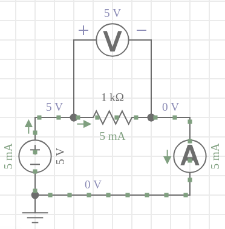
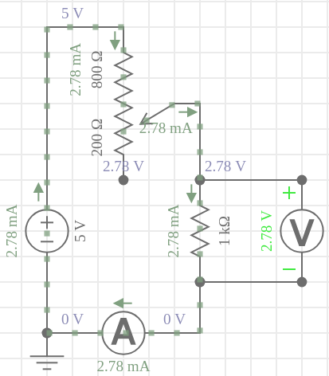

## Exp 1 - Ley de ohm DC

**Elementos:**

- 2 multimetros
- fuente dc
- proto, cables,1 resistencia, 1 potenciometro

---

**Opción A) Medir ley de ohm con fuente de corriente variable**

- La idea es ir variando la tensión en la fuente y con dos multimetros medir la caida de tensión en la resistencia y la corriente que circula por el circuito. 

- Luego graficar la relacion $I$ vs $V$ y verificar que la pendiente de la recta es la resistencia.

---

**Opción B) Medir ley de ohm con fuente DC fija, variando la tensión utilizando un potenciometro.**

- La idea es fijar la fuente en un nivel de tensión, e ir variando la resistencia $R_1$ del potenciometro. Al variarla, crearemos distintos niveles de caida en $R_2$. Tenemos que medir $V$ y $I$ para distintos valores de $R_1$ y luego estudiar la ley de ohm $I$ vs $V$.

- Concepto del divisor de tensión:

$$
V_0 = V_{R_1} + V_{R_2} = I (R_1 + R_2)
$$

$$
V_{R_1} = I R_1 = \frac{R_1}{R_1+R_2} V_0
$$

$$
V_{R_2} = I R_2 = \frac{R_2}{R_1+R_2} V_0
$$

- Nos iteresa la tensión en $R_2$, así que si tenemos: $V_0=5 V$, $R_1=800\Omega$, $R_2=1000\Omega$, entonces:

$$
V_{R_2} = \frac{1000}{800+1000} 5 [V]= 2.78 V 
$$

- Verificamos la corriente:

$$
I = \frac{5}{1000+800} [A] = 0.0028 A = 2.8mA
$$

Tal como se verifica en el esquema.
