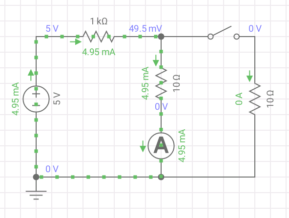
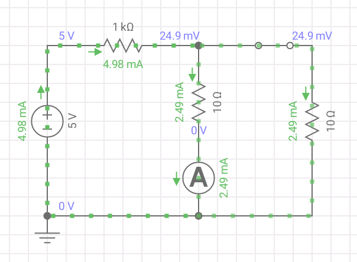
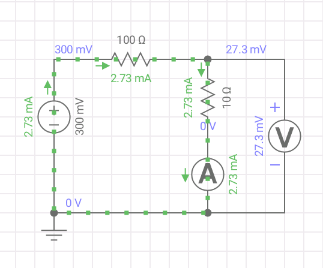
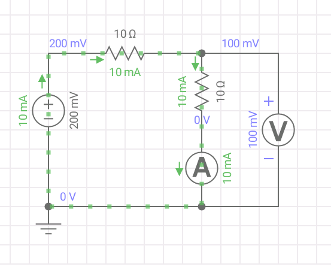

## Exp 2 - Resistencia interna del amperimetro

### Elementos

- Fuente 
- 2 Multímetros
- Resistencias de carbono / Resistencias variables

### Opción A) Con llave interruptora

**Procedimiento:**

Con la llave cerrada se mide la corriente que circula sobre el amperimetro, $i_0$:

Se cierra la llave y se ajusta el potenciometro hasta que la corriente que mide el amperimetro es $i_0/2$:

luego la resistencia del amperimetro es aproximadamente la del potenciometro, $r_A \sim r_p$.

**Explicación de por que vale $r_A = r_p$ :**

A $t=0$, se toma nota de la corriente que circula por el amperimetro, la $i_0$, la trensión de la fuente es:

$$
V_0 = i_0 (R_L+r_A)
$$

A $t>0$ se cierra la llave y se ajusta el potenciometro hasta medir exactamente la mitad: $i_0/2$. Quiero escribir las corrientes del circuito, la tensión sobre el paralelo es:

$$
V_{//} = \frac{i_0}{2} r_A = i_p r_p
$$

Escribo $i_p$ en función de $i_0$:

$$
i_p = \frac{i_0}{2} \frac{r_A}{r_p}
$$

Además sabemos que por ley de mallas:

$$
i_L = \frac{i_0}{2} + \frac{i_0}{2} \frac{r_A}{r_p} = \frac{i_0}{2} \rho
$$

$$
\rho= 1 +\frac{r_A}{r_p}
$$

La tensión de la fuente antes y después de cerrar la llave es:

$$
V_0 = i_0 (R_L+r_A) = \frac{i_0}{2}\rho R_L + \frac{i_0}{2}r_A
$$

Busco expresar $r_A$ en función de $r_p$:

$$
2(R_L + r_A) = \rho R_L +  r_A
$$

$$
2 + 2\frac{r_A}{R_L} = \rho + \frac{r_A}{R_L}
$$

$$
2 + 2\frac{r_A}{R_L} = 1 + \frac{r_A}{r_p} + \frac{r_A}{R_L}
$$

$$
\frac{r_A}{r_p} = 1 + \frac{r_A}{R_L}
$$

Note que si $R_L>>r_A$ entonces $r_A=r_p$.

**Ordenes de magnitud de los valores a utilizar**

Como necesitamos $R_L>>r_A$, con $R_L\approx 1k$ andamos bien para que valga la aproximación. La tensión de la fuente no debe ser muy alta, con $V_0 \approx 5V$ drenamos corriente del orden de los $2mA$ lo cual es perfectamente resoluble.

**Resistencia límite inferior para corriente máxima:**

Para no quemar el amperimetro, es importante verificar el valor maximo de corriente que soporta, dependiendo del multimetro en el orden de los $\sim 100 mA$. Esto nos pone un limite en el valor de las resistencias a utilizar. Con el interruptor cerrado el circuito es un divisor de tensión, luego:

$$
V_0 = I_{max}(R_L + r_A)
$$

Si $V_0=5V$, $r_A \sim 1 \Omega$, $I_{max}=100mA$, luego:

$$
{R_L} = V_0/I_{max} - r_A = 5000/100 - 1 = 49 \Omega
$$

  Ese es el **limite inferior** de la resistencia, el valor elegido tiene que ser mas grande.

### Opción B) Por ley de Ohm

La idea es variar la tensión en la fuente y medir la tensión que cae en el amperimetro. De esta manera utilizando la medición de corriente que este genera, por ley de ohm se puede estimar la resistencia interna.

Utilizamos un divisor de tensión, variando la tensión de la fuente con valores bajos $V_0 \approx 200mV - 1V$ y una resistencia limitante pequeña para obtener buena resolución, del orden de los $100\Omega$ vamos a drenar corriente del orden de los $2mA$.

Se recopilan los valores de corriente $i_A$ y de tensión $V$.

Por ley de ohm la resistencia será $R= \frac{V}{i_A}$.

### Opción C) Ajustando resistencia limitante

Se setea una fuente con muy bajo voltaje $V_0 \approx 200mV$. Se varia la resistencia limitante hasta que se registra un voltaje de la mitad del entregado por la fuente. Por las propiedades del divisor de tensión, la resistencia del amperimetro será igual a la resistencia limitante.

