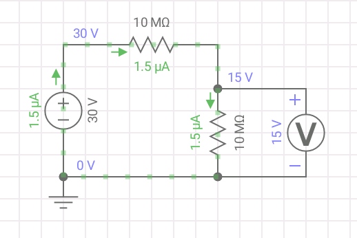
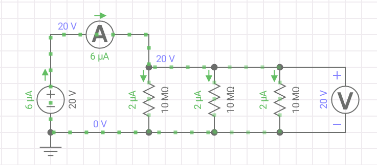

## Determinación de la resistencia interna del voltímetro

### Elementos

- Fuente DC
- 1 Potenciometro
- 2 multimetros

### Oción A) Usando un divisor de tensión

  
La idea es variar la resistencia limitante hasta medir $V = V_0/2$.

Como es un divisor de tensión, al medir caidas iguales en las dos reistencias implica la presencia de resistencias iguales. Entonces la resistencia del multimetro será la del potrenciometro.

- Cuidados:
  
  - Recordar que la resistencia del voltimetro esta alrededor de $\sim 10M\Omega$, usar una resistencia variable que pueda explorar esos valores.
  - Como estamos trabajando con resistencias muy grandes, en este caso hay que llevar la tensión a los limites de la fuente $V_0\approx 30 V$.

### Ocpión B) Utilizando la ley de Ohm

La idea es variar la tensión de la fuente, medir tensión, corriente y utilizar la ley de Ohm para obtener la resistencia del voltímetro. 

La clave acá es armar una configuración de resistencias que nos permita drenar la suficiente corriente para poder medirla ( $ I>2 \mu A $ ). 

Una configuración útil es colocar varias **resistencias iguales en paralelo y del orden de magnitud de la resistencia del voltímetro**. Variar la tension en el rango de los $20V-30V$, graficar una recta y ajustar para obtener la resistencia equivalente.

Notar que una vez que tenemos el ajuste, la resistencia equivalente es:

$$
\frac{1}{R_e} = \frac{1}{R}+\frac{1}{R}+\frac{1}{R_v}
$$

luego,

$$
R_v = [\frac{1}{R_e}-\frac{2}{R} ]^{-1}
$$