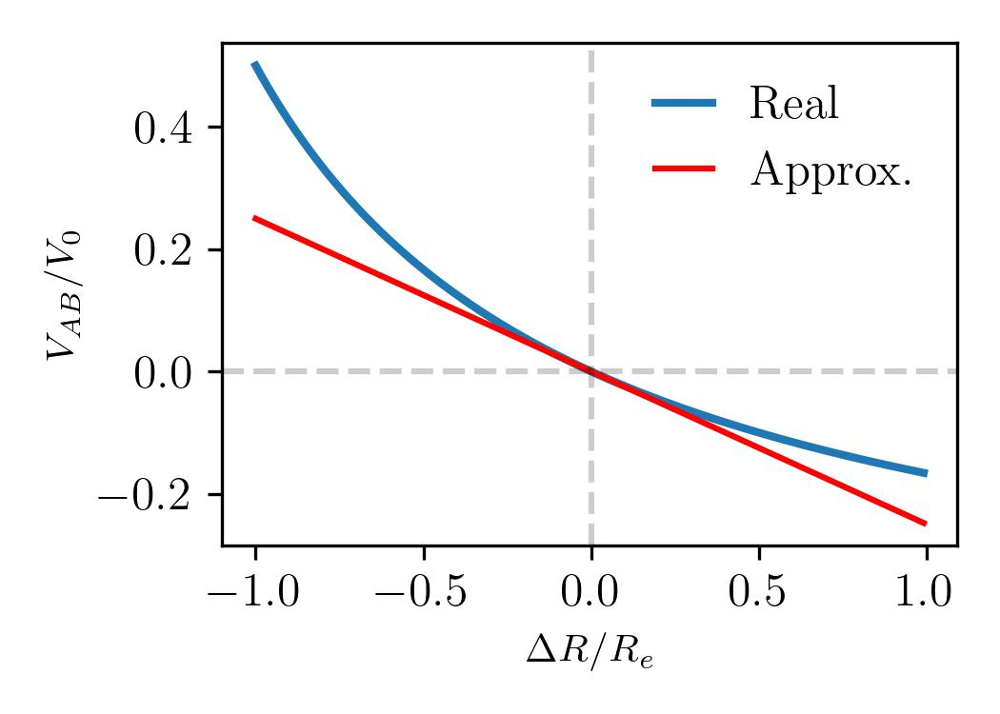
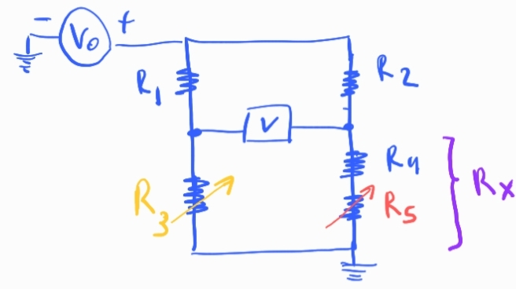
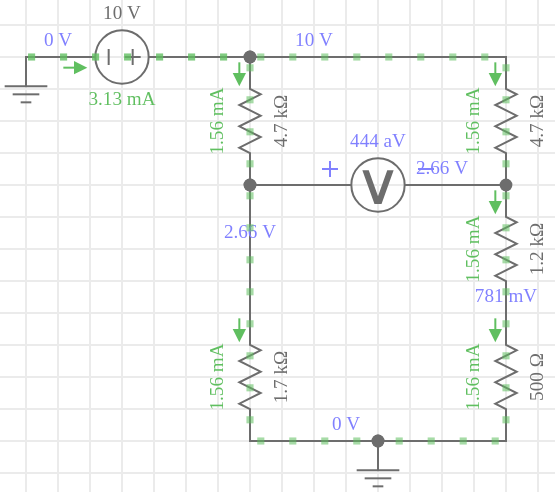
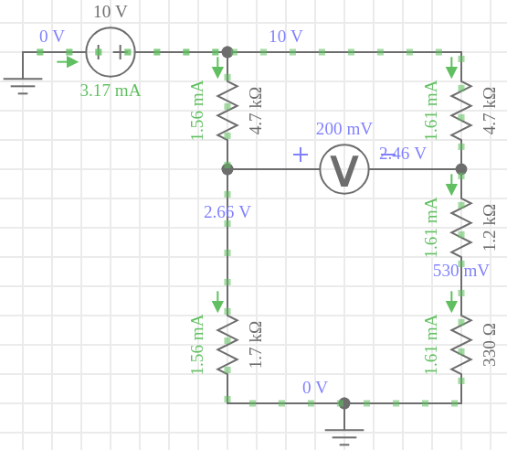

# Puente de Wheatstone

El puente divide la corriente del circuito:

$$
I= I_1+I_2
$$

Las corrientes que circulan por las dos ramas del puente se pueden escribir como:

$$
I_1 = \frac{V_0}{R_1+R_3}
$$

$$
I_2 = \frac{V_0}{R_2+R_x}
$$

Busco la diferencia de potencial entre A y B del circuito:

$$
V_A-V_B = I_1 R_3 - I_2 R_x
$$

$$
V_A-V_B = V_0 \big( \frac{R_3}{R_1+R_3} - \frac{R_x}{R_2+R_x}  \big)
$$

La condición de equilibrio del puente es $V_{AB}=0$, luego la relación entre resistencias debe cumplir:

$$
\frac{R_3}{R_1+R_3} - \frac{R_x}{R_2+R_x} = 0
$$

$$
R_3(R_2 + R_x) = R_x(R_1+R_3)
$$

$$
\frac{ R_3}{R_1} = \frac{R_x}{R_2} 
$$

El cosiente entre las resistencias de la rama 1 tiene que ser igual al cociente entre las resistencias de la rama 2.

Entonces la idea para medir la resistencia incognita es ajustar $R_3$ hasta que el puente este en equilibrio, $V_{AB}=0$. Una vez fijado el valor de esta resistencia que equilibra el puente, puedo utilizar la expresión anterior para obtener el valor de $R_x$.

### El puente como sensor de cambios de resistencia

Sea $R_e$ la resistencia que equilibra el puente, supongamos que en $R_x$ hacemos una pequeña perturbación respecto al equilibrio:

$$
R_x = R_e + \Delta R
$$

luego la caída de potencial en los bornes del puente puede expresarse así:

$$
\frac{V_{AB}}{V_0} =  \frac{R_3}{R_1+R_3} - \frac{R_e + \Delta R}{R_2+ R_e+\Delta R}
$$

$$
\frac{V_{AB}}{V_0} =  \frac{R_3}{R_1+R_3} - \frac{R_e (1+ \frac{\Delta R}{R_e})}{ (R_2 + R_e) (1+ \frac{\Delta R}{ R_e + R_2}) }
$$

Usando la condición de equilibrio $R_e = R_2R_3/R_1$, se puede ver que:

$$
\frac{R_e}{R_2 + R_e} = \frac{R_3}{R_1 + R_3} = \gamma
$$

Luego podemos escribir:

$$
\frac{V_{AB}}{V_0} = \gamma \big( 1 - \frac{ 1+ \frac{\Delta R}{R_e} }{ 1 + \frac{\Delta R}{R_e}\gamma  }     \big)
$$

El siguiente término se puede expandir en serie así:

$$
\frac{ 1 }{ 1 + \frac{\Delta R}{R_e}\gamma } \approx 1 -  \frac{\Delta R}{R_e}\gamma
$$

luego

$$
\frac{V_{AB}}{V_0} \approx \gamma \big [ 1 - ( 1 + \frac{\Delta R}{R_e} ) (1 -  \frac{\Delta R}{R_e}\gamma) \big]
$$

Haciendo la distribución y despresiando términos de orden $\Delta R ^2$, obtenemos:

$$
\frac{V_{AB}}{V_0} \approx \frac{\Delta R}{R_e} \gamma (\gamma-1)
$$

En terminos de las resistencias:

$$
\gamma (\gamma-1) = \frac{R_e}{R_2 + R_e} (\frac{R_e}{R_2 + R_e} -1 ) = \frac{R_e}{R_2 + R_e} ( \frac{-R_2}{R_e + R_2} ) = - \frac{R_3}{R_1+R_3} \frac{R_2}{R_e + R_2}
$$

luego la tensión:

$$
\frac{V_{AB}}{V_0} \approx - \frac{\Delta R}{R_e} \frac{R_3 R_2}{ (R_1+R_3)(R_e + R_2) }
$$

Note que si el puente tiene todas las resistencias iguales, $R_e=R_1=R_2=R_3$, entonces la caída de tensión es:

$$
\frac{V_{AB}}{V_0} \approx -\frac{1}{4} \frac{\Delta R}{R_e}
$$

En el siguiente gráfico vemos que esta aproximación funciona muy bien para cambios pequeños en la resistencia:

# Experimento propuesto

- 1 Voltímetro (V)
- $V_0= 10 V$
- $R_1 = 4.7k\Omega$ 
- $R_2= 4.7 k\Omega$
- $R_3 \in (0,10k\Omega )$ variable (Res. décadas)
- $R_4= 1.2 k\Omega$ fija
- $R_5 \in (0, 1k\Omega)$ variable (Res. décadas)

En este contexto $R_x = R_4 + R_5$

**Procedimiento para buscar el equilibrio**

Fijar $R_5$ en un punto intermedio
Variar $R_3$ hasta equilibrar el puente, es decir hasta medir $0 V$ en el voltímetro.

**Generar pequeñas perturbaciones**

Con el puente equilibrado, variar $R_5$ hacia valores mas altos y hacia valores más pequeños para producir pequeños apartamientos del equilibrio. Registrar lo medido y comparar con los resultados analíticos.

## Testing en simulaciones

- A continuación muestro valores obtenidos con el puente equilibrado:

- Quiero ahora apartarme del equilibrio $-10\%$. Para eso tengo que modificar el valor de $R_5$ de manera acorde.

$$
R_e = (1200 + 500) \Omega = 1700 \Omega
$$

$$
\frac{\Delta R}{Re}=0.1= \frac{\Delta R}{1700 \Omega}
$$

$$
\Delta R = 170 \Omega
$$

Para setear ese valor tengo que modficar $R_5$:

$$
R_x = 1200 \Omega + (500 - 170) \Omega
$$

Entonces tengo que fijar $R_5 = 330 \Omega$. Obtengo estos valores:

Al disminuir la resistencia de la rama derecha aumenta la corriente que circula por esa rama, no así la de la rama de la izquierda, por que no modifique las resistencias de esa rama. Esta modificación también verifica un leve aumento de la corriente total demandada a la fuente.

El multimetro mide $200 mV$, veamos si la aproximación derivada anteriormente verifica ese valor:

$$
V_{AB} \approx - \big (\frac{-170}{1700} \frac{1700\times 4700}{ (4700+1700)(1700 + 4700) }\big) 10 V
$$

$$
V_{AB} \approx \frac{1}{10} \times \frac{7.99}{ 40.96 } \times 10 V \approx 195 m V
$$

Como vemos la aproximación es bastante buena.
