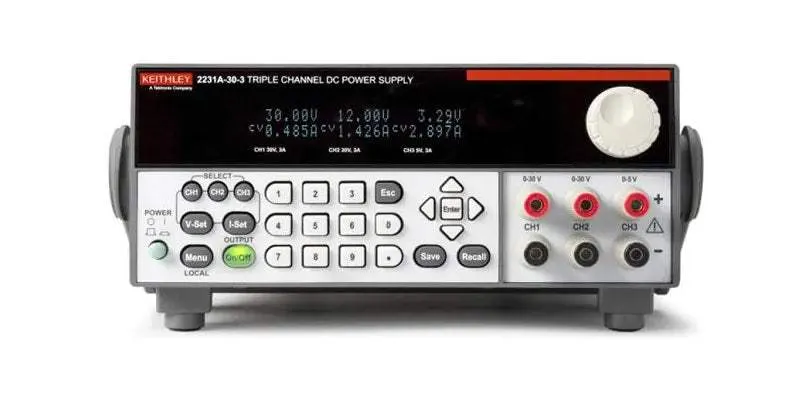

## Fuente KEITHLEY DC POWER 2231A-30-3

[Manual de uso](https://www.cedesa.com.mx/pdf/keithley/keithley_2231A-30-3_datasheet.pdf?var=DeTcH9R1n8)

[Video tutorial](https://www.youtube.com/watch?v=Rgw_zjn_qyk)

- La 2231A-30-3 tiene tres canales independientes:
  
  - Canal 1 (CH1): 0–30V, 0–3A
  - Canal 2 (CH2): 0–30V, 0–3A
  - Canal 3 (CH3): 0–5V, 0–3A

- Modos de Operación

  - Independiente: Cada canal funciona por separado.
   
  - Serie/Paralelo: Puedes conectar salidas en serie (para mayor voltaje) o paralelo (para mayor corriente) usando los terminales de salida y configurando la fuente adecuadamente (consulta el manual para detalles).

---

## Fuente HANTEK DC POWER PPS2320A

[Manual](https://www.circuitspecialists.com/content/95006/csi2320a_manual.pdf)

[Video tutorial](https://youtu.be/0s29dpC3Zk0?t=636)

