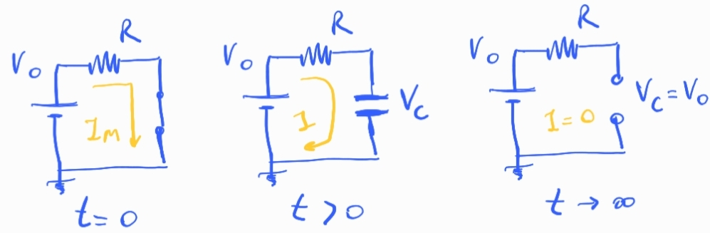
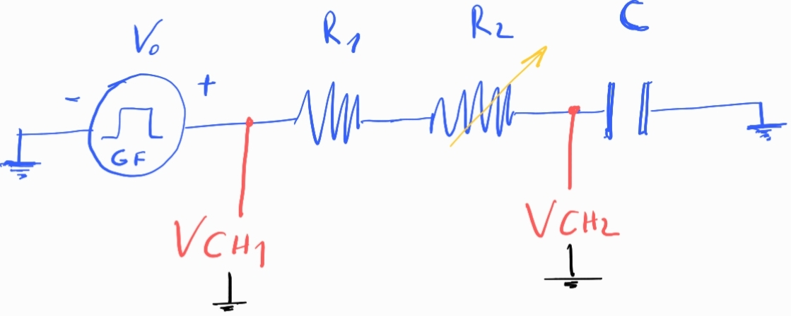

## Circuito RC

### 1. Conceptos básicos

#### Carga

En $t=0$,  el capacitor esta descargado y se comporta como un corto circuito.

La corriente inicial es la máxima que explorará el circuito:

$$
I_{Max} = I_0 = \frac{V_0}{R}
$$

En $t>0$ el capacitor empieza a acumular carga en sus placas y por lo tanto aparece una diferencia de potencial dependiente del tiempo:

$$
V_C(t) = V_0  (1 - e^{-\frac{t}{\tau}}),\quad \tau=RC
$$

La corriente en el circuito decrece como:

$$
I (t) = I_0  e^{-\frac{t}{\tau}}
$$

A medida que pasa el tiempo se acumula más carga, este proceso hace que la diferencia de potencial en los bornes del capacitor evolucione haste alcanzar la tensión de la fuente, a partir de ese momento deja de circular corriente.

En $t\to\infty$ la corriente es nula y la tensión en los bornes del capacitor es igual a la de la fuente. A este tiempo el circuito se comporta como abierto en los bornes del capacitor.

El proceso es análogo a poner un compresor a inflar un globo, cuando la presión interna del globo iguala la del compresor deja de circular aire. En nuestro caso el compresor es la fuente, la presion en el globo es la tensión, y el flujo de aire es la corriente.

La constante de tiempo $\tau=RC$ es una medida del tiempo característico del sistema, note que depende de los valores de los componente del circuito, resistencia y capacitancia. 

Si $R$ es chica respecto de $C$ el tiempo característico será chico. Si $R$ es grande el tiempo característico es grande.

Se dice que el circuito esta estacionario cuando transcurrieron 5 veces $\tau$, en ese momento:

$$
V_C(t=5\tau) = V_0  (1-e^{-5}) = V_0 \;(1-0.007) \approx V_0 
$$

$$
I(t=5\tau) = I_0 \times 0.007 \approx 0
$$

#### Descarga

Durante el proceso de carga el capacitor acumula energía entre sus placas en forma de campo eléctrico,

$$
E_C = \frac{1}{2}C V_0^2
$$

Si el capacitor esta cargado y cortocircuitamos la fuente $V_0$, descarga su energía almacenada en el circuito.

Lo hace sobre la resistencia que disipará la energía por efecto Joule.

Se comporta temporalmente como una fuente. En ese proceso, la tensión sobre los bornes del capacitor cae exponencialmente,

$$
V_C = V_0 e^{-\frac{t}{\tau}}
$$

y la corriente también, con sentido de circulación contrario al proceso de carga.

$$
I = -I_0 e^{-\frac{t}{\tau}}
$$

### 2. Experimento propuesto

La idea es exitar el circuito con una onda cuadrada para estudiar el proceso de carga y descarga del capacitor. 

Obetivos:

- Variar la resistencia $R_2$ para obtener distintas configuraciones
- Obtener ciclos de carga y descarga completos
- Lograr ajustes adecuados de $V_C(t)$ e $I(t)$ de los cuales extraigan el tiempo característico para cada valor de $R_2$
- Comprobar la linealidad entre $\tau$ y $R$. Con un ajuste determinar $C$

Los tiempos de alto y bajo de la onda cuadrada tienen que ser de aprox $t > 5\tau$ para observar todo el proceso de carga y descarga adecuadamente.

En el chanel 1 se mide la tensión del generador de funciones, ese canal puede obtenerse con un *conector tipo T* directo del generador.

En el chanel 2 se mide la tensión en los bornes del capacitor.

La corriente se mide indirectamente como:

$$
I = \frac{V_{CH1}- V_{CH2}}{ R_1+R_2 }
$$

**Propagación de errores**

Para obtener el error de la corriente hay que propagar el error tensión y resistencia.

El error de la tensión depende de la escala del osciloscopio.

El error de la resistencia depende del error del voltimetro que utilizamos para medirla.

Si tenemos variables independientes y errores pequeños, el error se puede calcular con el método de derivadas parciales:

$$
\Delta I = \sqrt{
(\frac{\partial I}{\partial V_1}\Delta V_1 )^2 +  
(\frac{\partial I}{\partial V_2}\Delta V_2 )^2 +
(\frac{\partial I}{\partial R_1}\Delta R_1 )^2 +
(\frac{\partial I}{\partial R_2}\Delta R_2 )^2 
} 
$$

**Cosas a tener en cuenta**

Sea $T=1/f$ el periodo de la señal cuadrada de frecuencia $f$. Para observar completo el proceso de carga y decarga del capacitor necesitamos que 

$$
\frac{T}{2} = \frac{1}{2f} > 10 \tau 
$$

entonces la frecuencia de la señal tiene que ser:

$$
f \approx \frac{1}{20RC}
$$

[Cálculo de la freq generador](https://colab.research.google.com/drive/14LEiFM1qyDkJrZ5-tHD0Md8l96riWtzj?usp=sharing)