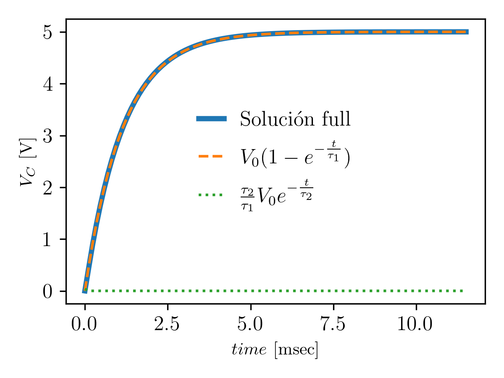

## Solución aproximada en el caso Sobre Amortiguado

Este regimen se caracteriza por la condición: 

$$
\gamma^2 > \omega_0^2.
$$

Donde, el coeficiente de amortiguamiento es,

$$
\gamma = \frac{R}{2L},
$$

y la frecuencia natural del sistema,

$$
\omega_0^2 = \frac{1}{LC}.
$$

La solución de la ecuación diferencial en este caso es,

$$
V_C(t) = V_0 \left( 1 - \frac{s_2 e^{s_1 t} - s_1 e^{s_2 t}}{s_2 - s_1} \right),
$$

$$
s_{1,2} = -\gamma \pm \sqrt{ \gamma^2 - \omega_0^2 }.
$$

### Aproximación 

Dado la expresión de los amortiguamientos, podemos escribirla así,

$$
s_{1,2} = \gamma \big[-1 \pm \sqrt{ 1 - \big(\frac{\omega_0}{\gamma}\big)^2 }\big],
$$

si suponemos $\gamma \gg \omega_0$, podemos aproximar la raiz como,

$$
\sqrt{ 1 - \big(\frac{\omega_0}{\gamma}\big)^2} \approx 1-\frac{1}{2}\big(\frac{\omega_0}{\gamma}\big)^2,
$$

luego, se puede encontrar una expresión aproximada para los amortiguamientos,

$$
s_{1,2} \approx \gamma \big[-1 \pm \big (1-\frac{1}{2}\big(\frac{\omega_0}{\gamma}\big)^2\big)],
$$

$$
s_1 \approx - \frac{1}{2}\frac{\omega_0^2}{\gamma},
$$

$$
s_2 \approx -2\gamma+\frac{1}{2}\frac{\omega_0^2}{\gamma} \approx -2\gamma.
$$

Reemplazando por las expresiones de $\gamma$ y $\omega_0$, tenemos,

$$
s_1 \approx - \frac{1}{2}\frac{\frac{1}{LC}}{\frac{R}{2L}} \approx -\frac{1}{RC} \approx -\frac{1}{\tau_1}
$$

$$
s_2 \approx -2 \frac{R}{2L} \approx -\frac{1}{\frac{L}{R}} \approx -\frac{1}{\tau_2} 
$$

Donde $\tau_1$ es el tiempo carácteristico de un circuito RC y $\tau_2$ es el tiempo característico de un circuito RL.

Vemos que en esta aproximación se desacopla el efecto del capacitor y del inductor en la parte dinámica de la solución,

$$
V_C(t) \approx V_0 
\left( 1 - 
\frac{ 
-\frac{1}{\tau_2} e^{-\frac{1}{\tau_1}t} + 
\frac{1}{\tau_1} e^{-\frac{1}{\tau_2} t}}
{-\frac{1}{\tau_2}} 
\right)
$$

$$
V_C(t) \approx V_0 
\left( 1 - e^{-\frac{t}{\tau_1} }+
\frac{\tau_2}{\tau_1} e^{-\frac{t}{\tau_2}}
\right) 
$$

$$
V_C(t) \approx 
V_0 \left( 1 - e^{-\frac{t}{\tau_1} } \right)+
\frac{\tau_2}{\tau_1} \left( V_0  e^{-\frac{t}{\tau_2}}
\right) \quad (*)
$$

Ahora, la condición $\gamma \gg \omega_0$ impone también condiciones sobre los $\tau_1$ y $\tau_2$ que tenemos que tener en cuenta para continuar el análisis,

$$
\gamma^2 \gg \omega_0^2
$$

$$
\frac{R^2}{4 L^2} \gg \frac{1}{LC}
$$

$$
\frac{1}{4} \frac{1}{\frac{L}{R}} \gg \frac{1}{RC}
$$

$$
\tau_1 \gg 4 \tau_2
$$

y finalmente,

$$
\tau_1 \gg  \tau_2
$$

Entonces en $(*)$ podemos ver que la exponencial asociada al tiempo característico $\tau_2$ decáe mucho mas rápido que la asociada a $\tau_1$. Además el cociente $\tau_2/\tau_1$ hace que ese termino sea más chico todavía.

En este régimen el capacitor domina la dinámica, y podemos aproximar la evolución de la tensión $V_C$ como el proceso de carga del capacitor.

$$
V_C(t) \approx V_0 
\left( 1 - 
e^{-\frac{t}{\tau_1} }
\right) 
$$

### Ejemplo

Supongamos que tenemos un circuito con los componentes,

$R= 1150$ $\Omega$, 
$L= 10$ $mH$, 
$C= 1$ $\mu F$, 
$V_0 = 5$ $V$.

Calculamos $\gamma^2$ y $\omega_0^2$ y hacemos el cociente, podemos ver que,

$$
\frac{\omega_0^2}{\gamma^2}= 0.030245 \approx 0.
$$

Entonces confirmamos que podemos hacer la aproximación. 
Calculando los tiempos característicos obtenemos,

$$
\tau_1= 1.15 \, m sec,
$$

$$
\tau_2= 8.69$ \, \mu sec,
$$ 

vemos que $\tau_2$ es muy chico respecto a $\tau_1$. Haciendo el cociente obtenemos,

$$
\frac{\tau_2}{\tau_1}= 0.030245 \approx 0.
$$

A continuación se muestra una comparación de las asociada a la solución sin aproximar, a la aproximación, y al termino a despreciar asociado a la exponencial con $\tau_2$,

Vemos que la aproximación es excelente.