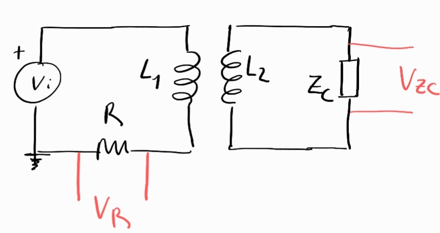

## Inducción

### 1. Caso una bobina dentro de otra sin núcleo

Se monta un circuito con la idea de medir la inductancia mutua entre dos bobinados, se plantea el siguiente esquema

<!--  -->

Planteado las ecuaciones del circuito del diagrama, tenemos,

$$
V_i = I_1 Z_{L1} \pm I_2 Z_M+ V_R
$$

$$
V_{ZC} = I_2 Z_{L2} \mp I_1 Z_M
$$

donde las impedancias son $Z_{L1}=j\omega L_1$, $Z_M=j \omega M$, $Z_{L2}=j \omega L_2$

Si $Z_C\to \infty$, por ejemplo en el caso de la impedancia de entrada del osciloscopio, el secundario queda abierto, entonces $I_2 \approx 0$ y $V_{ZC}=V_s$. Luego,

$$
V_i = I_1 j \omega L1 + V_R
$$

$$
V_{s} = \mp I_1 j \omega M
$$

En el secundario no circula corriente, pero hay una tensión inducida debido al acoplamiento con la bobina del primario.

Además como medimos la caida de tensión sobre la resistencia, sabemos

$$
V_R = I_1 R
$$

Y esto es muy bueno, porque estudiando la relación entre la caída de tensión del secundario y la caída de tensión en la resistencia, obtenemos,

$$
\frac{V_s}{V_R} = \frac{\mp I_1 j \omega M}{I_1 R},
$$

esto nos permite sacamos de encima $I_1$,

$$
 \frac{V_s}{V_R} = \frac{\mp j \omega M }{ R}.
$$

Luego, tomando modulo nos sacamos de encima la $j$ compleja y los signos, 

$$
 \frac{v_s}{v_R} = M \frac{\omega }{ R},
$$

donde $v_R$ es la amplitud CRMS medida con el osc sobre la resistencia y $v_s$ es la amplitud CRMS medida con el osc sobre el secundario.

**Propuesta de experimento**

Medir el cosiente de las amplitudes variando la frecuencia para obtener la inductancia mutua con un ajuste lineal.

$$
\frac{v_s}{v_R}\quad vs.\quad \frac{\omega}{R} \quad \to M
$$

Medir a frecuencias bajas, para $f>1$ kHz, aparecen no linealidades.

Además $M$ esta relacionado con las inductancias por la relación,

$$
M = k \sqrt{L_1 L_2}
$$

Luego, si midieron $L_1$ y $L_2$ con el multimetro-RLC, pueden determinar el valor de $k$ que pesa que tan bueno es el acople entre los inductores, en general encontraremos $k<0.8$

### 2. Caso con núcleo de hierro

Al introducir un nucleo de hierro en la bobina del primario, la inductacia de la bobina del primario se multiplicará por un factor,

$$
L_1^\prime = \mu L_1 
$$

pero, en este experimento, tambien aumentará la del secundario por que el núcleo también esta dentro de esta, 

$$
L_2^\prime = \mu L_2 
$$

en consecuencia, la inductancia mutua crecerá,

$$
M^\prime = k \sqrt{\mu L_1 \mu L_2}
$$

$$
M^\prime = k \sqrt{ L_1 L_2} \mu  = M \mu.
$$

Entonces, **si se repite el experimento con el núcleo magnético dentro de la bobina del primario**, estudiando la relacion $\frac{v_s}{v_R}$ vs. $\frac{\omega}{R}$ se puede obtener $M^\prime$ y con eso una estimación de $\mu$ como el cociente,

$$
\mu = \frac{M^\prime}{M}.
$$

Ese factor $\mu$ esta relacionado con las propiedades del material,

$$
\mu = \frac{\mu_r}{1+D},
$$

donde $\mu_r$ es la permeabilidad relativa del material, adimensional, que indica cuánto mejor es el material (vs. el vacío) para "concentrar" campo magnético. Este valor puede encontrarse en tablas.

Por otro lado, el factor $D$ representa la "imperfección" del camino que sigue el campo. Depende de la geometria del material. Si el material es un anillo, $D \approx 0$. En nuestro caso como el material es una barra $D>0$, el flujo se dispersa en el aire. Esta cantidad, se puede estimar como,

$$
D\approx \frac{l_b}{\mu_r A_{sb}}
$$

donde $l_b$ se puede estimar como el largo de la barra, $A_{sb}$ es el area de la sección del cilindro.

### 3. Importante! medir a bajas frecuencias

El circuito propuesto permite modelar el comportamiento del sistema (bobina acoplada dentro de otra) en **bajas frecuencias**, donde los efectos de acoplamiento magnético dominan. A altas frecuencias, este modelo simplificado pierde validez debido a:

- La aparición de capacitancias parásitas entre espiras y entre devanados.

- Pérdidas por corrientes parásitas en el núcleo (si está presente).

- Resonancias no deseadas por inductancias de dispersión y capacitancias.

Para frecuencias superiores a cierto limite, que depende de los componentes de tu circuito, es necesario incluir estos efectos en un modelo mas realista, por ejemplo añadiendo capacitancias en paralelo o resistencias de pérdidas. 

En el archivo [Inducción con compoenntes parásitos](2-%20Induccion%20con%20componentes%20parasitos.md) se muestra como ejemplo una propuesta de modelado que tenga en cuenta esos factores. 