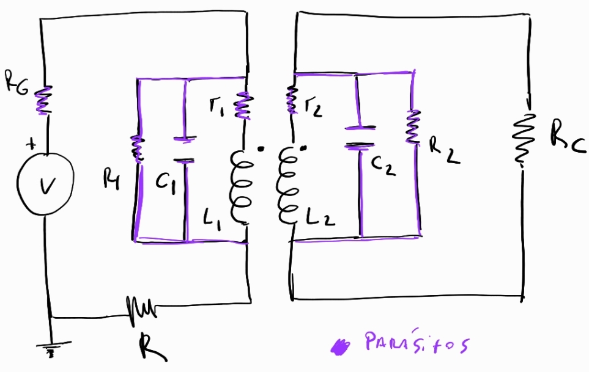
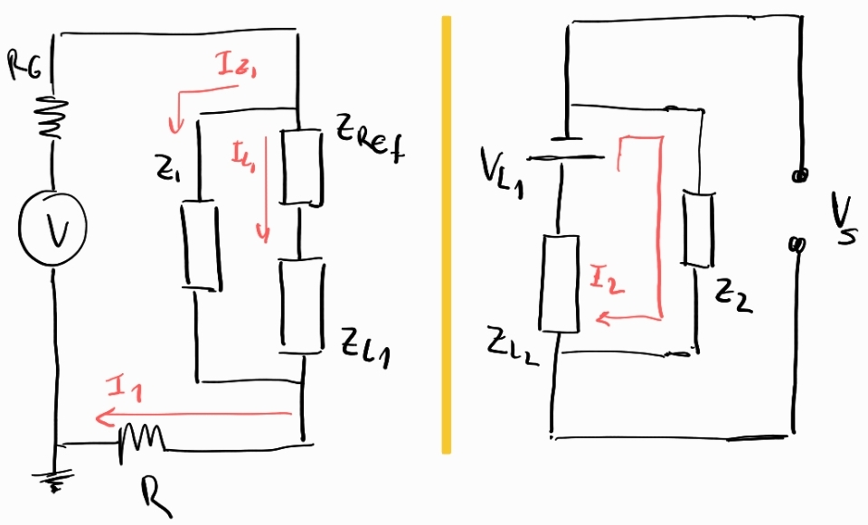

### Inducción una bobina dentro de otra, caso realista

Para el caso del experimento de una bobina dentro de otra, el modelo más simple falla a altas frecuencias. Esto es debido a la aparición de componentes parásitos en el circuito.

El efecto de alguno de estos componentes parásitos se puede modelar introduciendo combinaciones adecuadas de componentes ideales con el objetivo de capturar los efectos fisícos que producen los parásitos.

Mi propuesta para un modelo más realista esta basada en el siguiente circuito,

respecto del circuito ideal, se introduce lo siguiente,

- Resistencias internas de los bobinados
- Resistencias en paralelo al bobinado para modelar perdidas de corriente
- Capacitores en paralelo a los bobinados para capturar la capacitancia parásita que se forma en el devanado

Si bien este circuito parace complicado, se puede estudiar facilmente planteando dos circuitos equivalentes acoplados.

En el primario se introduce la cantidad $Z_{Ref}$, conocida como impedancia refleja, la cual acopla el efecto del secundario en el primario. 

En el secundario se introduce la *fuente inducida* $V_{L1}$ que acopla la tensión inducida por el primario en el secundario.

En el circuito primario las relaciones importantes son,

$$
Z_1 = R_1 {||} \frac{1}{j \omega C_1}
$$

$$
Z_{L1} = r_1 + j \omega L_1
$$

$$
Z_{Ref} = \frac{(\omega M)^2}{Z_{V_{L1}}}
$$

$$
I_1 = I_{L1} \bigg(\frac{Z_{Ref}+Z_{L1}+ Z_1 }{Z_1} \bigg)
$$

$$
V_R = I_1 R
$$

Aquí, $Z_{V_{L1}}$ es la impedancia que ve la *fuente inducida* $V_{L1}$ en el secundario.

Por otro lado, en el circuito secundario,

$$
V_{L1} = j \omega M I_{L1} = Z_M I_{L1}
$$

$$
I_2 = \frac{V_{L1}}{(Z_2 + Z_{L2})}
$$

$$
V_S = -V_{L1} + I_2 Z_{L2}
$$

Donde $I_2$ es la corriente generada por la *funte inducida* $V_{L1}$ que circula sobra la carga de las impedancias de la rama. $V_S$ sale por leyes de Kirchhoff.

Luego se llega a las relaciones,

$$
V_S= I_{L1} Z_M \bigg( -1  + \frac{Z_{L2}}{Z_2+Z_{L2}} \bigg)
$$ 

$$
V_R= R I_{L1} \bigg(\frac{Z_{Ref}+Z_{L1}+ Z_1 }{Z_1} \bigg)
$$

Luego la ecuación de transferencia compleja viene dada por el cociente,

$$
T = \frac{V_S}{V_R} = 
\frac{ Z_M( \frac{Z_{L2}}{Z_2+Z_{L2}}-1) }
{R(\frac{Z_{Ref}+Z_{L1}+ Z_1 }{Z_1})}
$$

Si medimos amplitud CRMS sobre los bornes de $R$ y sobre el secundario, se puede utilizar el módulo de esa expresión para intentar ajustar los datos a alta frecuencia y obtener los valores de los parámetros parásitos.

En el programa [Inducción modelo realista](../../Data_analisis/4.Magnetismo/4.2.Analisis_induccion/Induccion_Modelo_Realista.ipynb), se muestra un ejemplo de como utilizar esta expresión para hacer el ajuste.
