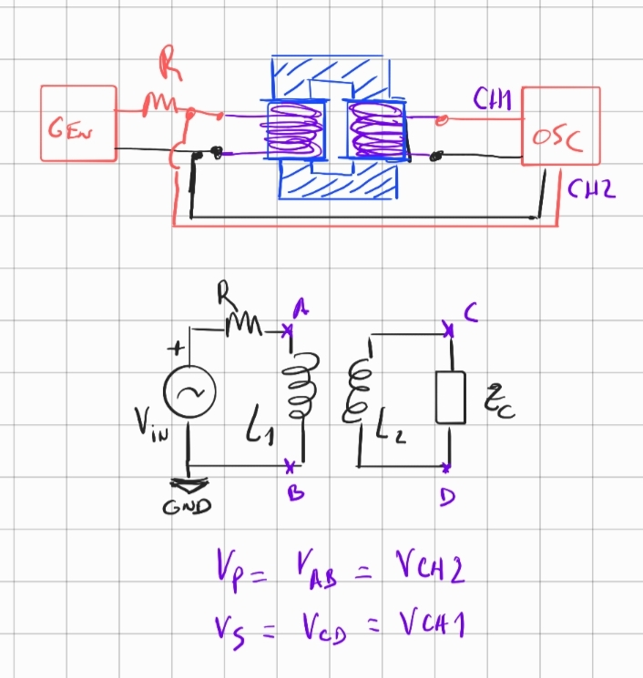
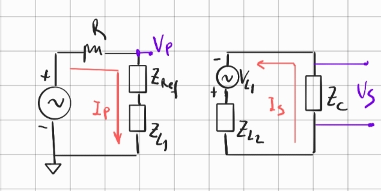

# Transformadores

### 1. Relación entre las tensiones del transformador y el número de vueltas de los bobinados

Se tienen dos bobinados conectados por un núcleo de hierro. El esquema y el circuito esta dado por,

<!--  -->

Para resolver este sistema es muy útil plantear su equivalente. Este viene dado por dos cicuitos separados pero acoplados con las siguientes características,

 
<!--  -->

Los parámetros de acople, en términos generales, vienen dados por,

- $V_{L1} = I_{L1} j \omega M$ es la fuente inducida en el secundario debido a la presencia del primario, donde $I_{L1}$ es la corriente que circula por la bobina $L_1$

- $Z_{Ref}= \frac{(\omega M)^2}{Z_{V_{L1}}}$ es la impedancia que ve el primario debido a la presencia del secundario. Acá, $Z_{V_{L1}}$ es la impedancia que ve la fuente inducida $V_{L1}$. 

En particular para este caso, la corriente que circula por la bobina $L_1$ es es $I_{L1}=I_p$, la impedancia que ve la fuente inducida es $Z_{V_{L1}} = Z_{L2}+Z_c$, y la impedancia reflejada es $Z_{ref}= \frac{(\omega M)^2}{Z_{L2}+Z_c}$.

Con esto, escribimos las tensiones en los bornes del secundario y del primario de la siguiente manera,

$$
V_s = I_s Z_c = V_{L_1} \frac{Z_c}{Z_c + Z_{L_2}}
$$

$$
V_p =  I_p \big[ Z_{Ref}+Z_{L_1}\big] = I_p \big[\frac{(\omega M)^2}{Z_{L2}+Z_c}+Z_{L_1}\big]
$$

En la condición $Z_c \to \infty$, es decir a circuito abierto como es nuestro caso, nos queda,

$$
V_s \approx V_{L_1}
$$

$$
V_p \approx I_p Z_{L_1}
$$

Haciendo el cociente entre la tensión en el secundario y la tensión en el primario, obtengo,

$$
\frac{V_s}{V_p} \approx \frac{V_{L_1}}{I_p Z_{L_1}} = 
\frac{\cancel{I_p j \omega} M}{\cancel{I_p j \omega} L_1}
$$

$$
\frac{V_s}{V_p} \approx \frac{k \sqrt{L_1 L_2} }{L_1} 
= k \frac{\sqrt{L_2}}{\sqrt{ L_1}}
$$

Sabemos, además, que el valor de las inductancias esta relacionado con la geometría y propiedades del material de la siguiente manera,

$$
L = \frac{\mu_0 \mu_r A N^2}{l}
$$

Suponiendo que ambas bobinas estan hechas de la misma dimensión, del mismo material, y que solo difieren en el número de vueltas, obtenemos lo siguiente,

$$
\frac{V_s}{V_p} \approx k \frac{N_2}{N_1}
$$

Para el **caso ideal** el acoplamiento es perfecto, luego **k=1**, y recuperamos la relación archi conocida entre las tensiones del transformador y el número de vueltas de sus bobinas. Spoiler, en el labo eso nunca se cumple, en general se observa $k<0.8$, y si te vas a frecuencias altas los componentes parásitos rompen todo, así que ojo.

### 2. Experimento propuesto

La idea es variar la relación entre vueltas de los transformadores, medir amplitud en el secundario y en el primario y obtener la constante de acoplamiento $k$ mediante un ajuste lineal,

$$
\frac{v_s}{v_p} \quad vs.\quad \frac{N_2}{N_1} \quad \to k
$$

Se puede repetir el experimento abriendo una de las partes del núcleo de hierro para ver como se modifica el acoplamiento y en consecuencia el valor de $k$.

Precauciones:
- Trabajar en un rango de frecuencias BAJO, fijarla por debajo de los $500$ Hz.
- Apagar la fuente al cambiar los bobinados.
- Utilizar el multímetro RLC del pañol para medir los valores de $L_1$ y $L_2$, 

