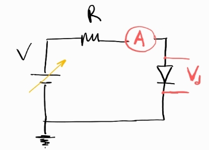
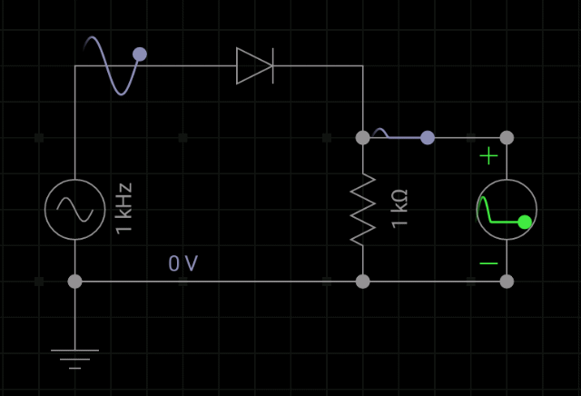

### Conceptos básicos

Una forma intuitiva de entender los diodos, es pensarlos como una llave, dada ciertas condiciones esa llave se abre y permite que la corriente fluya en una sola dirección sobre la rama donde se encuentra el diodo. Sin esas condiciones, este componente NO permitirá la circulación.

Pero ¿cuáles son esas condiciones? Tenemos que pensar en dos cosas:

 - Que polarización tiene?, es decir como esta colocado en el circuito respecto de las fuentes. Diremos que esta **polarizado en directa** si el anodo es colocado del lado de potencial más alto, y diremos que esta **polarizado a la inversa** cuando el anodo esta colocado del lado del potencial más bajo.
 - Cuál es la diferencia de potencial a la cual esta siendo sometido? polarizado en directa, todos los diodos tienen un **tension umbral** a partir de la cual la llave se abre y deja circular corriente. Polarizado a la inversa solo el diodo Zener tiene una tensión a partir de la cual la llave se abre y se deja circular corriente en la dirección opuesta, esta se conoce como **tensión de ruptura**.

#### Diodos de silicio 

Este tipo de diodo trabaja polarizado en **directa** y deja circular corriente cuando esta siedo sometido a valores $V_d >0.6-0.7$ $V$. 

#### Diodos Led 

Los diodos Led tambien trabajan polarizados en **directa**, y deja circular corriente cuando $V_d >1.8-3$ $V$, esto depende del color del led.

#### Diodo Zener

Este tipo de diodo puede trabajar en **directa y en inversa**. 
En directa funciona de forma similar a un diodo de silicio, con $V_d >0.6-0.7$ $V$. En inversa, el diodo Zener permite conducir corriente a una tensión de ruptura de $V_Z > 2.4-5.6$ $V$.

---
## Experimentos

### (1) Medición de la curva del diodo

#### Opción 1. Utilizando un fuente de continua

Variar la tensión de tensión de la fuente en un rango $(0-5)V$, medir con un amperimetro la corriente, y con un voltimetro la caida de tensión sobre los bornes del diodo.

Por debajo del valor umbral, no circula corriente y el diodo funciona como un circuito abierto, toda la tensión cae sobre el diodo.

Al llegar al valor umbral empieza a circular corriente y la tensión de entrada empieza a caer en la resistencia.

Si sigo aumentando el potencial en la fuente la tensión del diodo se mantendrá mas o menos constante, alrededor de $\sim 0.7V$ y toda la tensión restante caerá en la resistencia.

Graficar la curva $V_d$ vs. $I$

#### Opción 2. Excitando con una función tipo rampa

En la opción 1 se varia la tensión de la fuente y se mide corriente y tensión de manera manual. Una forma de automatizar y agilizar la medición es usar un generador de funciones operado en su función rampa. Esto nos permite "barrer" los valores de tension de entrada facilmente. 

En esta configuración usamos el osciloscopio para medir en un canal la caida de tensión sobre el diodo y en el otro canal la caida de tensión sobre la resistencia. Con esto último se calcula la corriente simplemente dividiendo la señal por el valor de la corriente.

Una vez adquirida la señal vamos a tener datos como

$$
t, V_R(t)/R, V_d(t) 
$$

esto nos permite recuperar fácilmente la relación $V_d$ vs. $I$ buscada.

Es importante que la frecuencia de la rampa sea baja para tener mejor resolución temporal en el osciloscopio.

#### Ajuste de $V_d$ vs. $I$

Para ajustar esta relación se puede utilizar la ecuación de Shockley.

$$
I = I_S ( e^{\frac{V_d}{n V_T}} - 1 )
$$

Donde:

$I$: Corriente que atraviesa el diodo.

$I_S$: **Corriente de saturación inversa** (típicamente en el rango de $10^{-12}$ a $10^{-6}$ A, depende del material y construcción).

$V_d$: Voltaje aplicado al diodo (ánodo - cátodo).

$n$: **Factor de idealidad** (entre 1 y 2; $n = 1$ para diodos ideales, $n \approx 1.3$ a 2 en diodos reales).

$V_T$: **Tensión térmica** ($V_T = \frac{kT}{q}$):

$k$: Constante de Boltzmann ($1.38 \times 10^{-23}$ J/K).
$T$: Temperatura absoluta (en Kelvin).
$q$: Carga del electrón ($1.6 \times 10^{-19}$ C).
A temperatura ambiente ($T = 300$ K): $V_T \approx 26$ mV.

### (2) Rectificador de media onda

Se utiliza un solo diodo. Se exita con una señal alterna, la corriente solo circula cuando $V>0.7$ entonces la tensión en la resistencia estará relacionada con el semiciclo positivo de la fuente.

