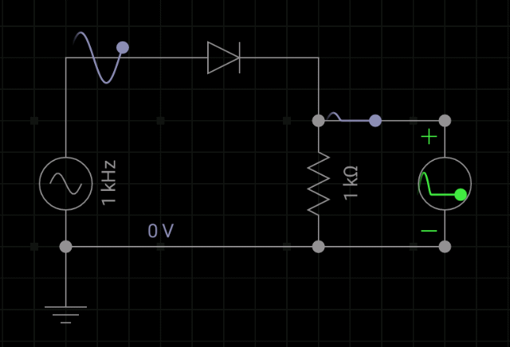
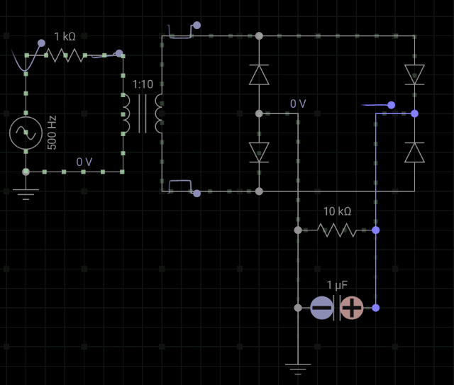

## 1. Rectificador de media onda

Se utiliza un solo diodo. Se exita con una señal alterna, la corriente solo circula cuando $V>0.7$ entonces la tensión en la resistencia estará relacionada con el semiciclo positivo de la fuente.

## 2. Rectificación de onda completa

En un rectificador de onda completa con diodos en puente se invierten los semiciclos negativos, convirtiendo la señal en una sucesión de pulsos positivos:

Agregando un **capacitor** en paralelo suavizamos la señal a la salida.

