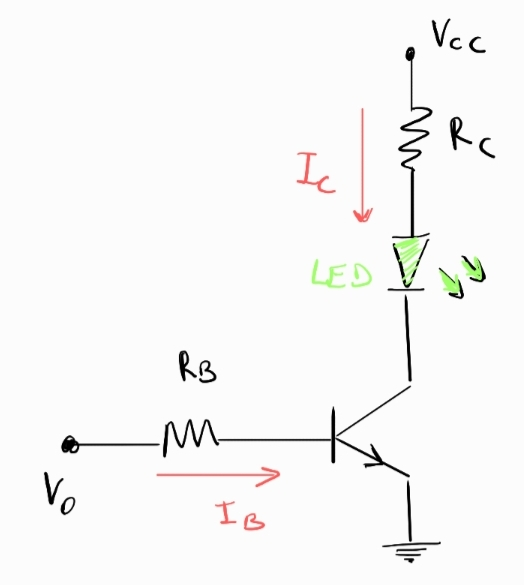

## Conceptos básicos

Un transistor es un componente circuital no lineal basado en semiconductores. No es la idea explicar aquí el detalle de su funcionamiento, sino más bien adquirir una cierta intuición de como y para que se utiliza.

La forma más intuitiva de pensarlo es como un tubo con agua mas un grifo: Si cerramos el grifo no circula agua (CORTE), si lo abrimos un poquito, circulará algo de agua (ACTIVA), y  si lo abrimos todo circulará toda el agua disponible (SATURACIÓN).

Como ven, el grifo me permite **controlar** la circulación de agua.

Ahora bien, volviendo a la electronica, el transistor es un elemento de tres patas: Base, Colector y Emisor. La base nos permite abrir el grifo: haciendo circular una pequeña corriente por esa rama, controlamos la corriente que circula por las ramas Colector - Emisor.

Notar que vale la ley de mallas,

$$
I_B = I_C + I_E
$$

Asimismo, hay dos tensiones importantes que tendremos que analizar: 

1) La tensión $V_{BE}$. Tenemos que pensar que entre B y E hay un diodo de silicio, por lo tanto para que el transistor salga de CORTE tenemos que asegurarnos de que caigan $0.7 V$ entre B y E.

2) La tensión $V_{CE}$. Setear de manera correcta esta tensión, me permite definir de que manera trabajará el transistor. 

En terminos generales el transistor trabaja en dos configuraciones: ACTIVA y CORTE-SATURACIÓN. De eso hablo en el apartado siguiente.

## Configuración y puntos de trabajo

Hay dos formas típicas de utilizar un transistor: ACTIVA y CORTE-SATURACIÓN. Para configurarlo para que trabaje en alguna de estás configuraciones, tenemos que elegir cuidadosamente los valores de las resistencias y de las fuentes del circuito. A continuación enumero las condiciones necesarias para hacer
la configuración en cada caso.

### 1. Activa

En esta configuración se cumple una relación muy importante entre la corriente de base y la corriente de colector,

$$
I_C = \beta I_B
$$

donde $\beta$ se conoce como ganancia. Su valor depende del modelo del transistor, un valor típico es $\beta=100$. En concreto, con una pequeña corriente de base podemos controlar una gran corriente de colector.

En esta configuración, la tensión entre colector y emisor, $V_{CE}$,  tiene que ser mayor $0.3V$.

En este punto de trabajo, el transistor se usa como **amplificador**. Las variaciones en la corriente de base se reflejan en la corriente de colector. Como la corriente de base es chica, sus pequeñas variaciones serán capturadas como grandes variaciones en la corriente de colector, lo cual permite amplificar la señal.

### 2. Corte - Saturación

En esta configuración utilizamos el transistor como una **llave electronica**. Quiero que si no hay corriente en la base, la llave este cerrada, y que cuando haya corriente en la base, la llave se abra POR COMPLETO. Es decir, en esta configuración quiero crear una especie de ON-OFF (0-1) controlado por la corriente de base. Esto que parece una pavada, es el fundamento de toda la electronica digital moderna así que respeten.

En la configuración CORTE-SATURACIÓN la corriente de base y de colector ya no siguen la relación lineal que teniamos en ACTIVA. En saturación ya abrimos la llave por completo, por más que se siga aumentando la corriente de base, la llave no se puede abrir más. Por eso se dice que esta **saturado**. No obstante, para hacer los calculos, la relación entre $I_B$ y $I_C$ se puede estimar definiendo un $\beta_{sat}$,

$$
I_C(sat) \approx \beta_{sat} I_B
$$

$$
\beta_{sat} = \beta/10
$$

Respecto a la tensión colector - emisor, tiene que ser menor a $0.3V$. Idealmente para los calculos podemos trabajar con $V_{CE}=0$.

## Ejemplos de cálculo y propuesta de experimentos

### (1) Interruptor ON-OFF: Encendido de un Led

En este ejemplo vemos como obtener los valores para que el transistor, configurado en CORTE-SATURACIÓN, funcione como un interruptor para encender un led.

La rama vertical tiene un Led que quiero encender. Para eso necesito que la diferencia de potencial en sus bornes sea $V_{LED}=2V$ y que la corriente $I_C\leq20mA$, para no quemarlo. En función de eso tendremos que calcular los valores de los otros parámetros del circuito.

Queremos hacer un interruptor ON/OFF, tal que cuando la tensión de control es $V_{BB}=0$ el led esta apagado, y cuando setee $V_{BB}\geq5V$ el led se prenda.

**Paso 1) Determinación de $R_C$**. 

En la rama vertical se tiene que cumplir

$$
V_{CC} = I_C R_C + V_{LED} + V_{CE}
$$

sabemos que $V_{LED}=2V$, $I_C\leq20mA$. Además queremos trabajar en saturación, entonces hacemos $V_{CE}=0$. Supongamos que seteamos $V_{cc}=5V$, algo típico. Con eso puedo calcular el valor de $R_C$ como,

$$
R_C = \frac{V_{cc} - V_{LED}}{I_C}
$$

$$
R_C = \frac{5 - 2 }{20.10^{-3}} [\Omega]
$$

$$
R_C = 150\Omega
$$

Como hice la cuenta con el valor límite que soporta el led, para estar tranquilo pongo una resistencia mas grande, por ejemplo tomo $R_C=200$ $\Omega$

**Paso 2) Determinación de $I_B$ necesaria**.

La relación $I_B$ vs. $I_C$ no es lineal en saturación. Usamos la ganancia efectiva $\beta_{sat}= \beta/10$, donde en este caso $\beta=100$ segun datos del fabricante. Luego,

$$
I_B = \frac{I_C}{\beta_{sat}}
$$

$$
I_B = 20mA/10 = 2mA
$$

**Paso 3) Determinación de $R_B$**.

En la rama horizontal se tiene que cumplir,

$$
V_{BB} = I_B R_B + V_{BE}
$$

Tomando $V_{BB}=5V$ y sabiendo que $V_{BE}=0.7$, entonces,

$$
R_B = \frac{V_{BB} - V_{BE}}{I_B}
$$

$$
R_B = \frac{5-0.7}{2.10^{-3}} [\Omega]
$$

$$
R_B \approx 2150 \Omega
$$

De nuevo, tomo una resistencia un poco más grande por seguridad, supongamos $R_B=2.5k\Omega$.

Hice una simulación con esos valores y obtuve lo siguiente,

Observaciones:

- La corriente en la base es 10 veces mas chica que en el colector, $I_B \ll I_C$
- La tensión $V_{BE}\approx 0.8V$, equivalente a la tensión de un diodo.
- La tensión $V_{CE} \approx 95 mV\approx 0V$, se cumple condición de CORTE-SATURACIÓN $V_{CE} < 0.3V$

Cuando implementen el circuito, pueden verificar como se apaga el led cuando $V_{BB}=0$ (Llave cerrada).