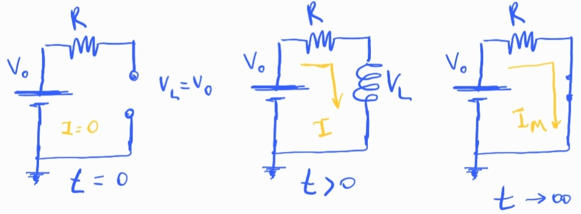
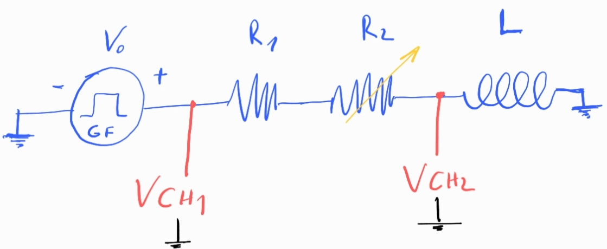

## Circuito RL

### 1. Conceptos básicos

#### Carga

En $t=0$ el circuito se comporta como un circuito abierto. Para oponerse al cambio inicial, donde empieza a circular corriente por el circuito, el inductor genera una tensión en sus bornes igual que la tensión de la fuente,

$$
V_L(t=0) = V_0
$$

Eso hace que no circule corriente en el circuito,

$$
I(t=0)=0
$$

En $t>0$ la tensión en la inductancia disminuye exponencialmente porque la fem inducida disminuye a medida que la corriente se estabiliza,

$$
V_L(t) = V_0  e^{-\frac{t}{\tau}}, \quad \tau= \frac{L}{R}
$$

asimismo la corriente aumenta de manera exponencial como,

$$
I(t) = \frac{V_0}{R} \big( 1- e^{-\frac{t}{\tau}} \big)
$$

Para $t \to \infty$, al estabilizarse la corriente el inductor no tiene cambio al cual oponerse, entonces no genera ninguna fem. Por tal motivo los bornes del inductor se comportan como un cortocircuito:

$$
V_L(t\to\infty)=0
$$

La corriente entonces, alcanza su valor máximo:

$$
I_{Max} = I_\infty= \frac{V_0}{R} 
$$

La constante de tiempo $\tau=\frac{L}{R}$ depende de los valores de los componentes del circuito. 

Si $R$ es chica respecto a $L$ tardará mucho tiempo en estabilizar la corriente. Si $R$ es grande la estabilización será rápida.

Consideramos que la corriente se estabiliza cuando $t=5\tau$, a ese tiempo:

$$
I(t=5\tau) = \frac{V_0}{R} ( 1- 0.007 ) \approx \frac{V_0}{R}
$$

y la tensión en los bornes del inductor es:

$$
V_L(t=5\tau) = V_0 \times 0.007 \approx 0
$$

#### Descarga

Mientras la fuente esta encendida, el inductor almacena energía en forma de campo magnético,

$$
E_L = \frac{1}{2} L I_\infty^2
$$

Si se corta la fuente abruptamente el inductor se opone al cambio de corriente en el circuito generando una tensión para mantener el flujo de corriente. Es decir, genera una "fuente" con la cara positiva mirando hacia donde sale la corriente, para "empujarla" y que no pare de circular. Entonces a $t=0$ la tensión será:

$$
V_L = - V_0
$$

Para $t>0$ la corriente que genera el inductor se disipa en la resistencia por efecto Joule decayendo exponcialmente:

$$
I(t) = I_\infty e^{-\frac{t}{\tau}}
$$

la tensión decae también de manera exponencial pero con la polaridad invertida:

$$
V_L(t) = - V_0 e^{-\frac{t}{\tau}}
$$

### 2. Experimento propuesto

La idea es exitar el circuito con una onda cuadrada para estudiar el proceso de carga y descarga del inductor. 

Obetivos:

- Variar la resistencia $R_2$ para obtener distintas configuraciones
- Obtener ciclos de carga y descarga completos
- Lograr ajustes adecuados de $V_L(t)$ e $I(t)$ de los cuales extraigan el tiempo característico para cada valor de $R_2$
- Comprobar la linealidad entre $\tau$ y $\frac{1}{R}$. Con un ajuste determinar $L$

Los tiempos de alto y bajo de la onda cuadrada tienen que ser de aprox $t \approx 5\tau$ para observar todo el proceso de carga y descarga adecuadamente.

En el chanel 1 se mide la tensión del generador de funciones, ese canal puede obtenerse con un *conector T* directo del generador.

En el chanel 2 se mide la tensión en los bornes del capacitor.

La corriente se mide indirectamente como:

$$
I = \frac{V_{CH1}- V_{CH2}}{ R_1+R_2 }
$$

**Propagación de errores**

Para obtener el error de la corriente hay que propagar el error tensión y resistencia.

El error de la tensión depende de la escala del osciloscopio.

El error de la resistencia depende del error del voltimetro que utilizamos para medirla.

Si tenemos variables independientes y errores pequeños, el error se puede calcular con el método de derivadas parciales:

$$
\Delta I = \sqrt{
(\frac{\partial I}{\partial V_1}\Delta V_1 )^2 +  
(\frac{\partial I}{\partial V_2}\Delta V_2 )^2 +
(\frac{\partial I}{\partial R_1}\Delta R_1 )^2 +
(\frac{\partial I}{\partial R_2}\Delta R_2 )^2 
} 
$$

### 3. Derivación y resolución de las ecuaciones diferenciales

### 4. Notas teóricas sobre el inductor
