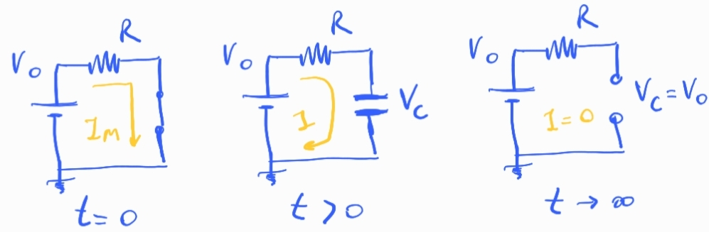

## Circuito RC

### 1. Conceptos básicos

#### Carga

En $t=0$,  el capacitor esta descargado y se comporta como un corto circuito.

La corriente inicial es la máxima que explorará el circuito:

$$
I_{Max} = I_0 = \frac{V_0}{R}
$$

En $t>0$ el capacitor empieza a acumular carga en sus placas y por lo tanto aparece una diferencia de potencial dependiente del tiempo:

$$
V_C(t) = V_0  (1 - e^{-\frac{t}{\tau}}),\quad \tau=RC
$$

La corriente en el circuito decrece como:

$$
I (t) = I_0  e^{-\frac{t}{\tau}}
$$

A medida que pasa el tiempo se acumula más carga, este proceso hace que la diferencia de potencial en los bornes del capacitor evolucione haste alcanzar la tensión de la fuente, a partir de ese momento deja de circular corriente.

En $t\to\infty$ la corriente es nula y la tensión en los bornes del capacitor es igual a la de la fuente. A este tiempo el circuito se comporta como abierto en los bornes del capacitor.

El proceso es análogo a poner un compresor a inflar un globo, cuando la presión interna del globo iguala la del compresor deja de circular aire. En nuestro caso el compresor es la fuente, la presion en el globo es la tensión, y el flujo de aire es la corriente.

La constante de tiempo $\tau=RC$ es una medida del tiempo característico del sistema, note que depende de los valores de los componente del circuito, resistencia y capacitancia. Se dice que el circuito esta estacionario cuando transcurrieron 5 veces $\tau$, en ese momento:

$$
V_C(t=5\tau) = V_0  (1-e^{-5}) = V_0 \;(1-0.0067) \approx V_0 
$$

$$
I(t=5\tau) = I_0 \times 0.0067 \approx 0
$$

#### Descarga

Durante el proceso de carga el capacitor acumula energía entre sus placas en forma de campo eléctrico,

$$
E_C = \frac{1}{2}C V_0^2
$$

Si el capacitor esta cargado y cortocircuitamos la fuente $V_0$, descarga su energía almacenada en el circuito.

Lo hace sobre la resistencia que disipará la energía por efecto Joule.

Se comporta temporalmente como una fuente. En ese proceso, la tensión sobre los bornes del capacitor cae exponencialmente,

$$
V_C = V_0 e^{-\frac{t}{\tau}}
$$

y la corriente también, con sentido de circulación contrario al proceso de carga.

$$
I = -I_0 e^{-\frac{t}{\tau}}
$$

### 2. Experimento propuesto

### 3. Derivación y resolución de las ecuaciones diferenciales

### 4. Notas teóricas sobre el capacitor de placas paralelas