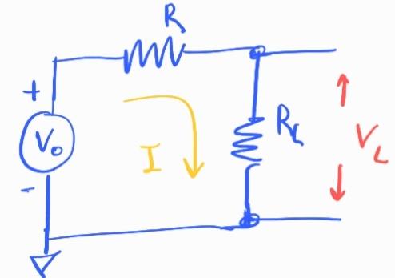
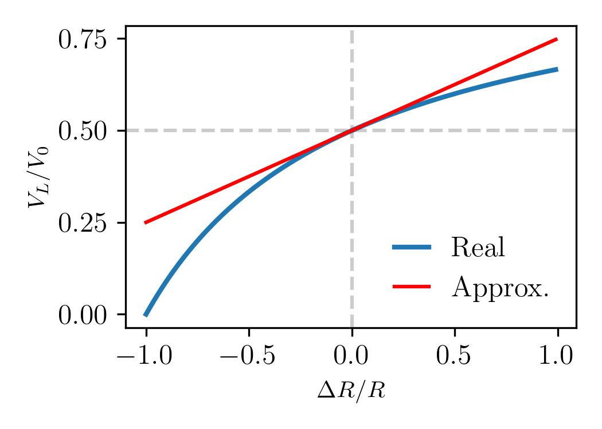
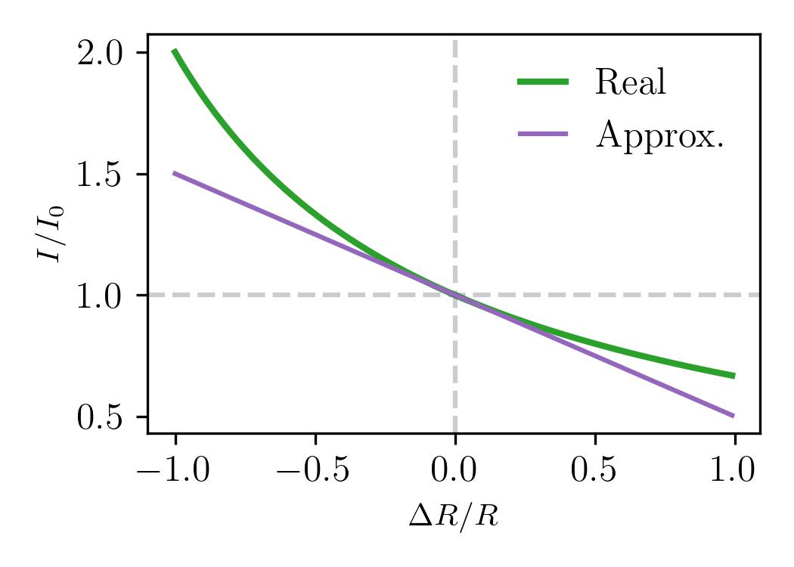
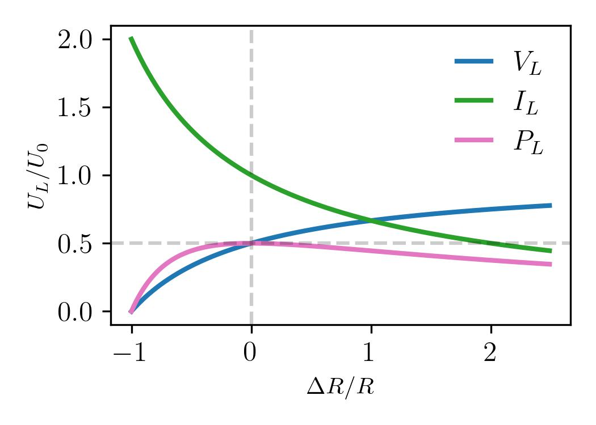

## Apunte sobre divisor de tensión

### Derivación

Tenemos 1 fuente de tensión $V_0$ que alimenta 2 resistencias en serie $R'$ y $R$:

Queremos estudiar la caída de tensión sobre la resistencia de carga $R_L$:

$$
V_L = I R_L
$$

La corriente que circula sobre las 2 resistencias es la misma:

$$
I = \frac{V_0}{(R + R_L)}
$$

Reemplazando la segunda en la primera ecuación, nos queda la tensión que cae sobre la resistencia $R_L$:

$$
V_L = V_0 \frac{R_L}{R + R_L}
$$

Note que la tensión de entrada se *divide* por un factor $\frac{R_L}{R + R_L}$.

-Si $R = 0$, entonces $V_L=V_0$ la tensión de entrada cae completamente sobre la carga $R_L$.

-Si $R \to \infty$, entonces $V_L=0$ la tensión de entrada cae completamente sobre $R$.

-Si $R_L=R$, entonces se cumple $V_L=V_R=\frac{V_0}{2}$, la tensión de entrada se divide en partes iguales.

Como se tiene que cumplir $V_0 = V_R+V_L$, entonces la tensíon que cae sobre la resistencia $R$ es:

$$
V_R = V_0 - V_0 \frac{R_L}{R + R_L} = V_0 \frac{R}{R_L + R}
$$

---

### Sensibilidad en la medición

Escribamos a la carga $R_L$ como a un apartamiento de $R$:

$$
R_L= R + \Delta R 
$$

En este marco, la caída de tensión en $R_L$ puede escribirse así:

$$
V_L = V_0 \frac{R+\Delta R}{R + R + \Delta R}
$$

luego, refiriendo la tensión de la carga, $V_L$, a $V_0$, nos queda la siguiente relación:

$$
\frac{V_L}{V_0} = \frac{1+\frac{\Delta R}{R}}{2+\frac{\Delta R}{R}} \quad (1)
$$

Note que si el apartamiento es cero, se recupera la condición $V_L=V_R=\frac{V_0}{2}$.

Si el apartamiento es chico la eq. 1 se puede aproximar. Sabemos que podemos expandir en serie el denominador asi:

$$
\frac{1}{2+\frac{\Delta R}{R}} = \frac{1}{2} \big(\frac{1}{1+ \frac{1}{2}\frac{\Delta R}{R}}\big) \approx \frac{1}{2} \big(   1- \frac{1}{2}\frac{\Delta R}{R}   \big)
$$

Reemplazando en (1),

$$
\frac{V_L}{V_0} \approx \frac{1}{2} \big(1+\frac{\Delta R}{R}\big) \big( 1- \frac{1}{2}\frac{\Delta R}{R}  \big)
$$

Eliminando términos de orden $\frac{\Delta R}{R}^2$, nos queda:

$$
\frac{V_L}{V_0} \approx \frac{1}{2} + \frac{1}{4} \frac{\Delta R}{R} \quad (2)
$$

Entonces, eq. 2 nos dice que pequeños apartamientos de valores de la carga, respecto de la resistencia de referencia nos producirá una caída de tensión lineal. 

En el siguiente gráfico podemos ver que la aproximación funciona muy bien:

analizando la diferencia entre curvas, se puede probar que en el intervalo $\frac{\Delta R}{R} \in (-0.54, 0.74)$ el error que se comete al usar la aproximación es siempre menor al $5\%$.

---

### Evolución de la corriente

La corriente que circula en el circuito viene dada por:

$$
I =  \frac{V_0}{(R + R_L)}
$$

Escribiendo, como antes, $R_L = R+\Delta R$, podemos estudiar como cambia la corriente ante pequeñas modificaciones de la carga:

$$
I = V_0  \frac{1}{R + R + \Delta R} = \frac{V_0}{2R}\big( \frac{1}{1+ \frac{1}{2}\frac{\Delta R}{R}}\big)
$$

Definimos como $I_0 = \frac{V_0}{2R}$, note que es la corriente que circula por el circuito cuando $R=R_L$. Entonces la corriente en el circuito luego de la modificación de la carga, referida a la corriente inicial es:

$$
\frac{I}{I_0}=  \frac{1}{1+ \frac{1}{2}\frac{\Delta R}{R}} \quad (3)
$$

Igual que antes, eq.3 se puede aproximar para pequeños apartamientos $\frac{\Delta R}{R}$:

$$
\frac{I}{I_0} \approx 1 - \frac{1}{2}\frac{\Delta R}{R}
$$

Note que cuando la carga crece la corriente disminuye, por que se agrega resistencia al sistema. En cambio cuando la carga disminuye la corriente crece.

En el siguiente gráfico podemos ver el buen funcionamiento de la aproximación:

Analizando la diferencia entre curvas, se puede probar que en el intervalo $\frac{\Delta R}{R} \in (-0.4, 0.5)$ el error que se comete al usar la aproximación es siempre menor al $5\%$.

---

### Potencia

La potencia disipada total en el circuito es:

$$
P_T = P_R + P_L
$$

En la resistencia de carga, la potencia disipada se puede escribir así:

$$
P_L = I V_L = I^2 R_L = \frac{V_L^2}{R_L}
$$

Siguiendo la estrategia de antes, podemos escribir $R_L = R+\Delta R$, luego la potencia será:

$$
P_L = I_0\; \frac{1}{1+ \frac{1}{2}\frac{\Delta R}{R}} \times \frac{V_0}{2}\; \frac{1+\frac{\Delta R}{R}}{1+\frac{1}{2}\frac{\Delta R}{R}} 
$$

$$
\frac{P_L}{P_0} = \frac{1}{2} \frac{1+\frac{\Delta R}{R}}{\big(1+\frac{1}{2}\frac{\Delta R}{R}\big)^2}
$$

Donde $P_0= I_0 V_0$, es la potencia disipada en el circuito.

En el gráfico se muestra la tensión la corriente y la potencia en $R_L$. 

Se puede ver que cuando las resistencias son iguales la potencia entregada a la carga es máxima.

Por encontrarse el máximo en $\frac{\Delta R}{R}=0$, se puede probar que la aproximación a primer orden para pequeños apartamientos es constante, de modo que si aumento o disminuyo la carga un poco respecto de la resistencia de referencia, $P_L\approx \frac{P_0}{2}$.

