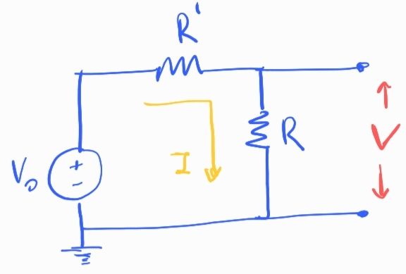
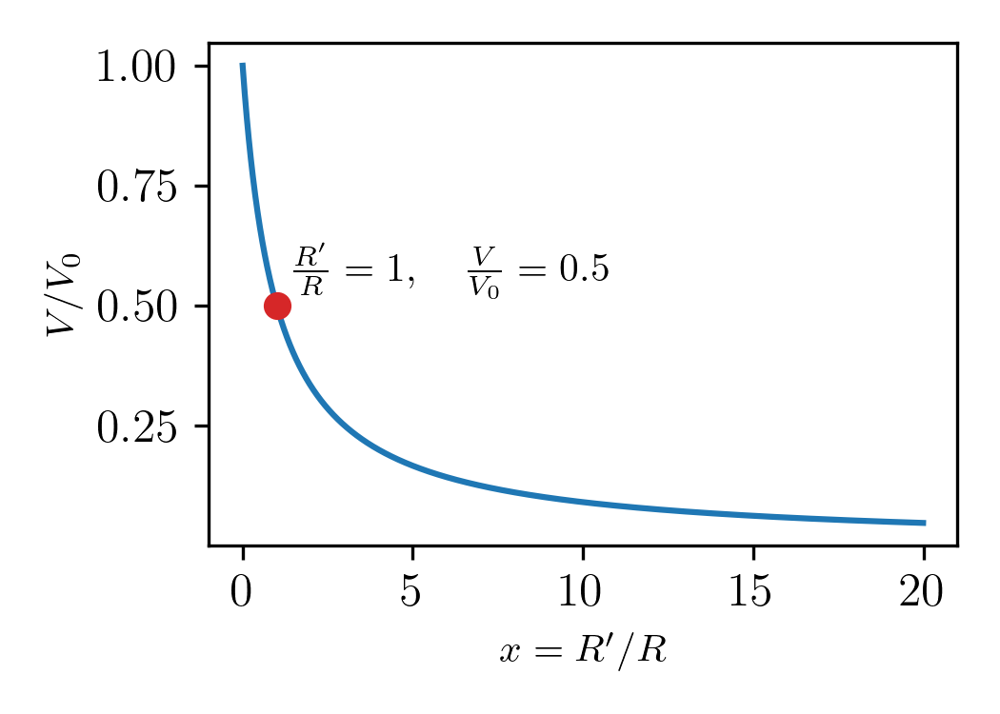
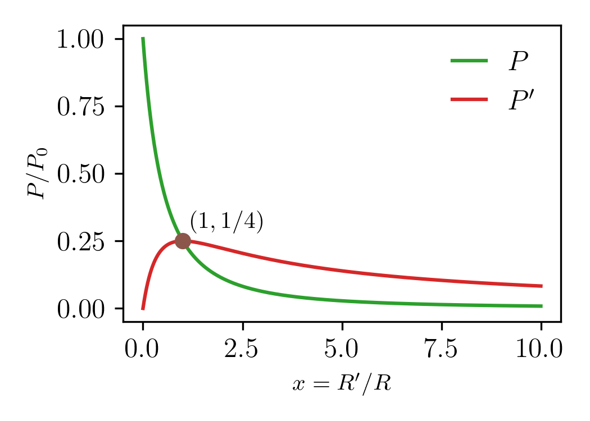
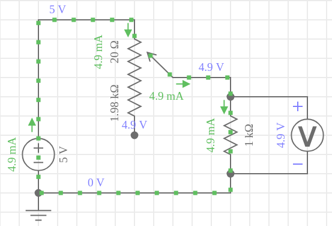
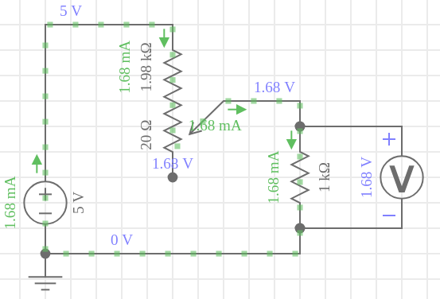

## Apunte sobre divisor de tensión

### Derivación

Tenemos 1 fuente de tensión $V_0$ que alimenta 2 resistencias en serie $R'$ y $R$:

Queremos estudiar la caida de tensión sobre la resistencia $R$:

$$
V = I R
$$

La corriente que circula sobre las 2 resistencias es la misma:

$$
I = \frac{V_0}{(R' + R)}
$$

Reemplazando la segunda en la primera ecuación, nos queda la tensión que cae sobre la resistencia $R$:

$$
V = V_0 \frac{R}{R' + R}
$$

Note que la tensión de entrada se *divide* por un factor $\frac{R}{R' + R}$.

-Si $R' = 0$, entonces $V=V_0$ la tensión de entrada cae completamente sobre $R$.

-Si $R' \to \infty$, entonces $V=0$ la tensión de entrada cae completamente sobre $R'$.

Como se tiene que cumplir $V_0 = V'+V$, entonces

$$
V' = V_0 - V_0 \frac{R}{R' + R} = V_0 \frac{R'}{R' + R}
$$

---

### Sensibilidad en la medición

La caída de tensión en la resistencia $R$ puede escribirse así:

$$
V = V_0 \frac{1}{x + 1}, \quad  x= \frac{R'}{R}
$$

Graficando la relacion $V/V_0$ vs $R'/R$, podemos ver como evoluciona $V$ en función de la relación entre las resistencias:

Para simplificar el análisis del gráfico, pensemos en valores de $V_0$ y $R$ fijos.

Lo primero que vemos es que en $x=0$, la tensión de salida es máxima $V=V_0$. Significa que cuando $R'=0$ toda la tensión de entrada cae sobre $R$.

Por otro lado, podemos ver que entre $x=0$ y $x=5$, la tensión cambia significativamente. Así mismo, para $x>5$ la tensión no cambia mucho. 

Entonces, en el intervalo $x\in(0,5)$ podemos decir que la tensión de salida $V$ es **sensible** a los cambios de $x$, comparado con lo que ocurre con el rango $x>5$.

.

**Determinacion del rango de mayor sensibilidad**

Se puede determinar analizando la derivada de $V$ respecto de $x$:

$$
\frac{dV}{dx} =V_0 \frac{-1}{(1+x)²}
$$

Vamos a pedir que el cambio en resistencia produzca un cambio significativo en la caída de la tensión:

$$
V_0 \frac{1}{(1+x)²} \geq \alpha
$$

$$
\frac{1}{(1+x)²} \geq \frac{\alpha}{V_0}
$$

por ejemplo, si fijamos la  relación $\alpha=0.1 V_0 $, es decir pedimos que el cambio en $R'$ produzca cambios en $V$ mayores o iguales al $10%$, se debe cumplir:

$$
\frac{1}{(1 + x)^2} \geq 0.1
$$

Resolviendo esta desigualdad:

$$
(1 + x)^2 \leq 10
$$

$$
1 + x \leq \sqrt{10}
$$

$$
x \leq \sqrt{10} - 1 \approx 2.16
$$

Esto indica que la sensibilidad es mayor cuando \( x \) está en el rango **$0 \leq x \leq 2.16$**.

Dentro de este intervalo, los cambios en $x$ generan diferencias más notorias en la caída de tensión sobre $R$.

En términos de la resistencia $R'$:

$$
0 \leq R' \leq 2R
$$

En ese rango tendremos una buena resolución para efectuar nuestra medicion.

### Evolución de la corriente

La corriente que circula en el circuito viene dada por:

$$
I = V_0 \frac{1}{(R' + R)} = I_0 \frac{1}{(x + 1)} 
$$

Con $I_0=\frac{V_0}{R}$. Vemos entonces que al variar $x$ la corriente en el circuito disminuye desde su valor máximo, $I_0$, hasta cero. Esto es por que estoy aumentando la resistencia en el circuito.

### Potencia

La potencia disipada total es:

$$
P_T = P + P'
$$

La potencia disipada en la resistencia $R$ viene dada por:

$$
P = I^2 R = I_0^2 \frac{1}{(x + 1)^2} R = P_0 \frac{1}{(x + 1)^2}
$$

donde $P_0 = I_0^2 R$ la potencia disipada en el circuito cuando $R'=0$. 
Vemos que la potencia en $R$ entonces cae más rápido incluso que la tensión y la corriente.

La potencia que disipa $R'$ en cambio, muestra un comportamiento menos trivial:

$$
P' = I^2 R' =  I_0^2 \frac{1}{(x + 1)^2} R' \frac{R}{R} = P_0 \frac{x}{(x + 1)^2} 
$$

vemos la presencia de un máximo en $P'$ cuando las resistencias son iguales, $x=1$. En ese caso, ambas resistencias disipan $P_0/4$.

La potencia no se conserva, se pierde por efecto Joule.

La potencia disipada va a cero cuando $x\to \infty$. Esto se debe a que una resistencia inifinita no permite que circule corriente y por lo tanto no hay disipación de potencia.

En un divisor de tensión, donde estamos variando una de las resistencias, la resistencia que esta fija explorará los mayores rangos de potencia cuando en particular cuando $R'<R$, deberá tenerse en cuenta los rangos de seguridad a la hora de diseñar en circuito. 

### Caso ejemplo:

Tenemos un circuito alimentado con una fuente de tensión $V_0=5V$. Con una resistencia de carga de $R= 1 k\Omega$ y un potenciometro $R'$ que puede variar desde $R'=0$ hasta $R'=2 k\Omega$.

Cuando $R'\sim 0$ obtenemos los siguiente valores:

Cuando $R'\sim 2R$ obtenemos los siguiente valores:

Podemos ver que el rango de tensiones $V$ accesibles es $(1.68V, 4.9V)$.

Así mismo, el rango de corrientes accesibles es $I$ es $(1.68mA, 4.9mA)$.

Si estamos usando resistencias de carbon que admite una potencia máxima de $P=0.25W$, la corriente de limitación será: 

$$
I_{Max}= \sqrt{P/R} = \sqrt{0.25/1000} = 15.8 mA
$$

Vemos que es bastante mayor a nuestro rango de corrientes de trabajo, esto nos asegura una medición dentro de los rangos de seguridad.
