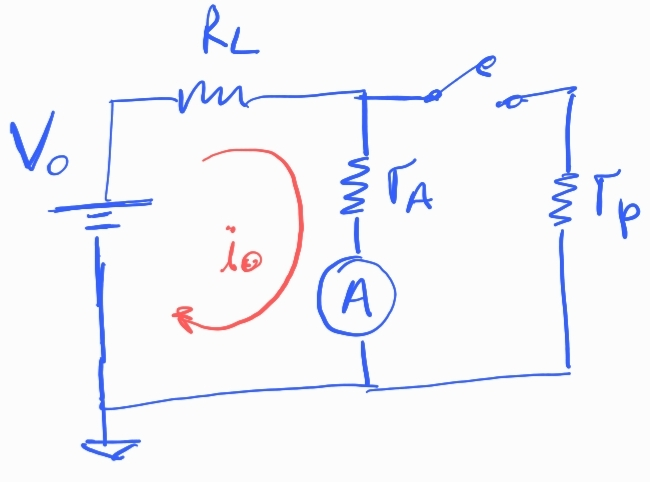
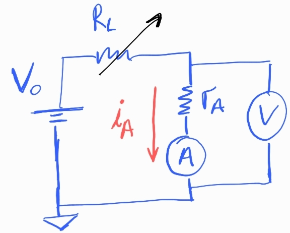

## Exp 2 - Resistencia interna del amperimetro

### Elementos

- Fuente 
- dos multimetros
- 1 resistencia, 1 potenciometro

### Opción A) Con llave interruptora

- Procedimiento:
  
  - Con la llave cerrada se mide la corriente que circula sobre el amperimetro, $i_0$.
  - Se cierra la llave y se ajusta el potenciometro hasta que la corriente que mide el amperimetro es $i_0/2$. 
  - luego la resistencia del amperimetro es aproximadamente la del potenciometro, $r_A \sim r_p$.

- Explicación de por que vale $r_A = r_p$ :
  
  A $t=0$, se toma nota de la corriente que circula por el amperimetro, la $i_0$, la trensión de la fuente es:

$$
V_0 = i_0 (R_L+r_A)
$$

  A $t>0$ se cierra la llave y se ajusta el potenciometro hasta medir exactamente la mitad: $i_0/2$. Quiero escribir las corrientes del circuito, la tensión sobre el paralelo es:

  $$
  V_{//} = \frac{i_0}{2} r_A = i_p r_p
  $$

  Escribo $i_p$ en función de $i_0$:

  $$
  i_p = \frac{i_0}{2} \frac{r_A}{r_p}
  $$

  Además sabemos que por ley de mallas:

  $$
  i_L = \frac{i_0}{2} + \frac{i_0}{2} \frac{r_A}{r_p} = \frac{i_0}{2} \rho
  $$

  $$
  \rho= 1 +\frac{r_A}{r_p}
  $$

  La tensión de la fuente antes y después de cerrar la llave es:

  $$
  V_0 = i_0 (R_L+r_A) = \frac{i_0}{2}\rho R_L + \frac{i_0}{2}r_A
  $$

  Busco expresar $r_A$ en función de $r_p$:

  $$
  2(R_L + r_A) = \rho R_L +  r_A
  $$

  $$
  2 + 2\frac{r_A}{R_L} = \rho + \frac{r_A}{R_L}
  $$

  $$
  2 + 2\frac{r_A}{R_L} = 1 + \frac{r_A}{r_p} + \frac{r_A}{R_L}
  $$

  $$  \frac{r_A}{r_p} = 1 + \frac{r_A}{R_L}
  $$

  Note que si $R_L>>r_A$ entonces $r_A=r_p$.

- Resistencia límite para corriente máxima: 
  
  Para no quemar el amperimetro, es importante verificar el valor maximo de corriente que soporta, dependiendo del multimetro en el orden de los $\sim 100 mA$. Esto nos pone un limite en el valor de las resistencias a utilizar. Con el interruptor cerrado el circuito es un divisor de tensión, luego:

$$
V_0 = I_{max}(R_L + r_A)
$$

Si $V_0=5V$, $r_A \sim 1 \Omega$, $I_{max}=100mA$, luego:

$$
{R_L} = V_0/I_{max} - r_A = 5000/100 - 1 = 49 \Omega
$$

  Ese es el limite inferior de la resistencia, el valor elegido tiene que ser mas grande.

### Opción B) Con voltímetro

- Procedimiento
  
  - Se fija la fuente en un valor $V_0$ de referencia y se varia el potenciometro $R_L$ **sin exceder la resistencia límite** para no quemar el amperimetro.
  - Se recopilan los valores de corriente $i_A$ y de tensión $V$.
  - Graficando la relación $i_A$ vs $V$ se puede obtener el valor de $r_A$ con un ajuste lineal.