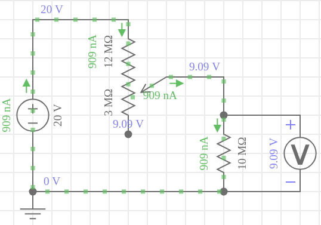
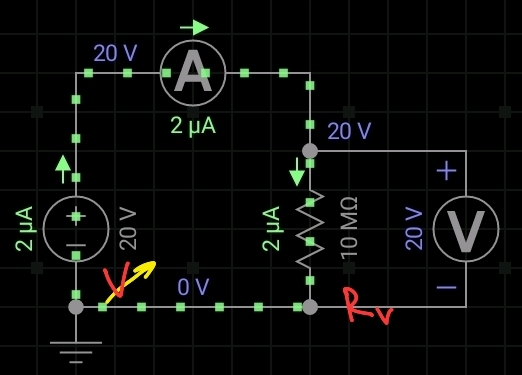

## Exp 3 - Resistencia interna del voltimetro

### Elementos

- Fuente DC
- 1 Potenciometro
- 2 multimetros

### Oción A) Varriando la tensión con un potenciometro

- Procedimiento:
  
  - Al variar el la resistencia del potenciometro variara la caida de tensión sobre el voltimetro. Variar hasta que $V = V_0/2$
  - Como es un divisor de tensión,a l medir caidas iguales en las dos reistencias implica la presencia de resistencias iguales. Entonces la resistencia del multimetro será la del potrenciometro.

- Cuidados:
  
  - Recordar que la resistencia del voltimetro esta alrededor de $\sim 10M\Omega$, usar un potenciomtro que pueda explorar esos valores.

### Ocpión B) Variando la tensión con la fuente

- Procedimiento:
  - Variar la tensión en la fuente y medir la corriente $i$ y la caida de tensión en el voltimetro $V$.
  - Graficar la relación $i$ vs $V$. Hacer un ajuste lineal para obtener $R$.
