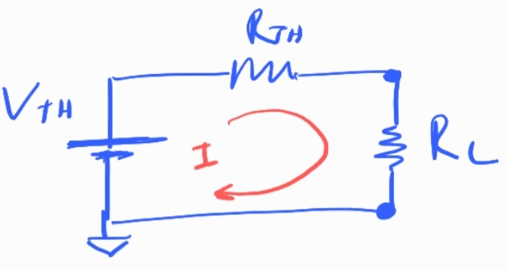
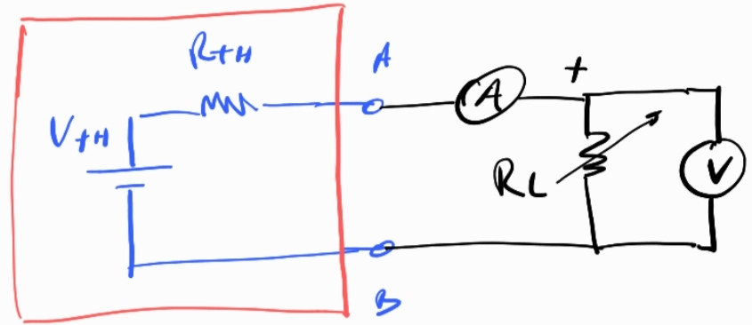

## Exp 6 - Transferencia de potencia

#### **1. Circuito Equivalente de Thévenin**

El circuito visto desde los terminales de la carga $R_L$ es:

#### **2. Expresión de la Potencia en $R_L$**

La potencia $P$ disipada en $R_L$ es:

$$
P = I^2 \cdot R_L
$$

Donde la corriente $I$ que fluye por el circuito es:

$$
I = \frac{V_{th}}{R_{th} + R_L}
$$

Sustituyendo $I$ en $P$:

$$
P = \left( \frac{V_{th}}{R_{th} + R_L} \right)^2 \cdot R_L
$$

Simplificando:

$$
P = \frac{V_{th}^2 \cdot R_L}{(R_{th} + R_L)^2}
$$

---

#### **3. Encontrar el Máximo de $P$ respecto a $R_L$**

Derivamos $P$ con respecto a $R_L$ e igualamos a cero:

$$
\frac{dP}{dR_L} = 0
$$

#### **Aplicando la regla del cociente**:

$$
\frac{dP}{dR_L} = V_{th}^2 \cdot \frac{(1) \cdot (R_{th} + R_L)^2 - R_L \cdot 2(R_{th} + R_L)}{(R_{th} + R_L)^4}
$$

Simplificando el numerador:

$$
(R_{th} + R_L)^2 - 2 R_L (R_{th} + R_L) = 0
$$

Factorizando:

$$
(R_{th} + R_L) \left[ (R_{th} + R_L) - 2 R_L \right] = 0
$$

$$
(R_{th} + R_L) (R_{th} - R_L) = 0
$$

**Solución**:

$R_{th} + R_L = 0$ → No física.  

$R_{th} - R_L = 0$ → $R_L = R_{th} $.

--- 

#### **4. Verificación del Máximo (Segunda Derivada)**

Segunda derivada en $R_L = R_{th}$:

$$
\frac{d^2P}{dR_L^2} \bigg|_{R_L = R_{th}} < 0 \quad \text{(Confirma máximo)}
$$

---

#### **5. Potencia Máxima**

Sustituyendo $R_L = R_{th}$:

$$
P_{\text{máx}} = \frac{V_{th}^2 \cdot R_{th}}{4 R_{th}^2} = \frac{V_{th}^2}{4 R_{th}}
$$

---

### **¿Por qué es importante la máxima transferencia de potencia?**

La condición de **máxima transferencia de potencia** (cuando $R_L = R_{th}$) es crucial en ingeniería y diseño de circuitos por varias razones prácticas:

---

#### **1. Aplicaciones Clave**

#### 🔌 **Electrónica de Potencia y Audio**

- **Amplificadores y altavoces**: Para entregar la máxima potencia a un altavoz (ej.: en equipos de sonido), la impedancia de salida del amplificador debe igualar la impedancia del altavoz ($R_L = R_{th}$).  
  - *Ejemplo*: Un amplificador de 8Ω debe conectarse a un altavoz de 8Ω para evitar pérdidas de potencia o distorsión.  

#### 📡 **Comunicaciones y RF**

- **Antenas y transmisores**: La impedancia de la antena ($R_L$) debe coincidir con la impedancia del transmisor ($R_{th}$) para:  
  - Maximizar la potencia transmitida.  
  - Minimizar reflexiones de señal (ondas estacionarias).  
  - *Ejemplo*: En WiFi o celulares, un desajuste de impedancias reduce el alcance de la señal.  

#### ☀️ **Energías Renovables**

- **Paneles solares y baterías**: Para extraer la máxima potencia disponible, la resistencia de carga debe adaptarse a la resistencia interna del panel/batería.  
  - *Ejemplo*: Los sistemas MPPT (*Maximum Power Point Tracking*) en paneles solares ajustan dinámicamente $R_L$ para mantener $R_L \approx R_{th}$.  

---

#### **2. Eficiencia vs. Potencia: Trade-off Importante**

- **Máxima transferencia de potencia ≠ Máxima eficiencia**.  
  - Cuando $R_L = R_{th}$, la eficiencia es solo del **50%** (la mitad de la potencia se disipa en $R_{th}$).  
  - *Ejemplo*: En sistemas de distribución eléctrica, se prioriza **eficiencia** (no máxima potencia), por lo que $R_L \gg R_{th}$ para reducir pérdidas.  

---

#### **3. Diseño de Circuitos y Sensores**

- **Sensores y transductores**: Para maximizar la señal de salida en sensores (ej.: termopares, micrófonos).  
- **Circuitos de acoplamiento**: En etapas de amplificación, se usa para transferir señales sin pérdidas.  

---

#### **¿Cuándo NO usarla?**

- En sistemas de **distribución de energía** (ej.: red eléctrica), donde importa más la eficiencia que la potencia máxima.  
- Cuando el calor disipado en $R_{th}$ sea crítico (ej.: circuitos integrados de baja potencia).  

--- 

## Experimento propuesto

Queremos estudiar la transferencia de potencia de un circuito hacia una resistenciad de carga.

- Elementos:
  - Un circuito que haga de caja negra, al cual se le calcula $V_{th}$ y $R_{th}$
  - 2 multimetros
  - 1 potenciometro ($R_L$)

- Procedimiento:
  Variar la resistencia de carga y estudiar la potencia como $P=IV$ encontrar máximo, chequear que se da cuando $R_L=R_{th}$.