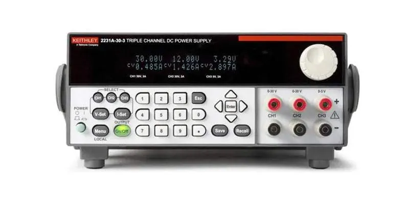
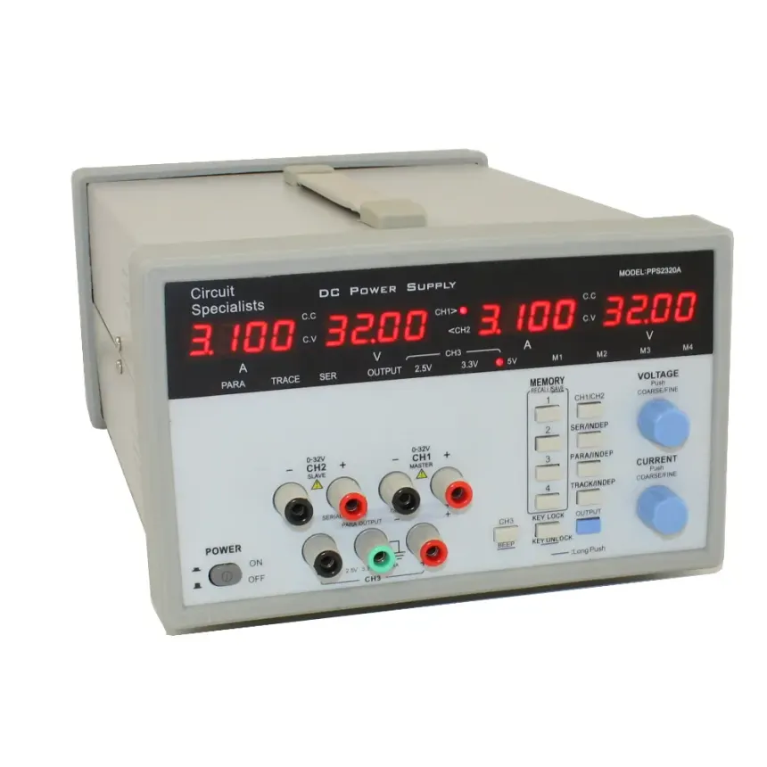

## Fuente KEITHLEY DC POWER 2231A-30-3

[Manual de uso](https://www.cedesa.com.mx/pdf/keithley/keithley_2231A-30-3_datasheet.pdf?var=DeTcH9R1n8)

[Video ejemplo](https://www.youtube.com/watch?v=Rgw_zjn_qyk)

La Keithley 2231A-30-3 es una fuente de alimentación DC triple (3 canales) programable, comúnmente utilizada en laboratorios de electrónica y pruebas. A continuación, te explico cómo operarla de manera básica:

1. Configuración Inicial Encendido:
- Conecta la fuente a la red eléctrica (220V/110V según specificaciones).

- Presiona el botón Power (Encendido) en el panel frontal.
2. Canales de Salida
- La 2231A-30-3 tiene tres canales independientes:
  
  Canal 1 (CH1): 0–30V, 0–3A
  Canal 2 (CH2): 0–30V, 0–3A
  Canal 3 (CH3): 0–5V, 0–3A
3. Configurar Voltaje y Corriente
   Para ajustar un canal (ej. CH1). Selecciona el canal: Presiona el botón CH1 en el panel.
   
   Ajusta voltaje:
   
   - Gira el knob (perilla) para fijar el voltaje deseado (ej. 12V).
     - También puedes ingresar el valor numérico directamente si la fuente tiene teclado numérico.
   
   Ajusta corriente límite:
   
   - Presiona el botón Current Limit (o similar).
   - Gira el knob para fijar la corriente máxima (ej. 1A para proteger tu circuito).

4. Habilitar la Salida
   Para activar un canal:
   Presiona el botón Output ON/OFF del canal seleccionado (CH1, CH2 o CH3).
   El LED junto al botón se encenderá indicando que hay salida.
   Para desactivarlo: Vuelve a presionar Output ON/OFF.

5. Modos de Operación
   Independiente: Cada canal funciona por separado.
   
   Serie/Paralelo: Puedes conectar salidas en serie (para mayor voltaje) o paralelo (para mayor corriente) usando los terminales de salida y configurando la fuente adecuadamente (consulta el manual para detalles).

---

## Fuente HANTEK DC POWER PPS2320A

[Manual](https://www.circuitspecialists.com/content/95006/csi2320a_manual.pdf)

[Video tutorial](https://youtu.be/0s29dpC3Zk0?t=636)

