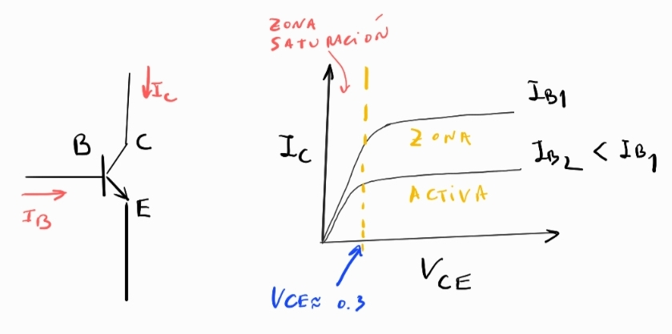
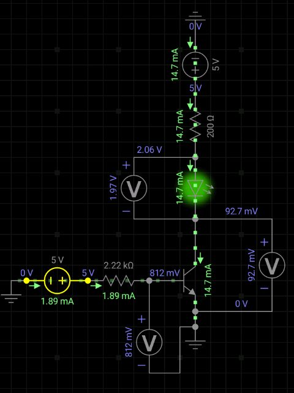

## Conceptos basicos

A esta altura de la evolución humana todos sabemos que los transistores son muy importantes en nuestras vidas, pero ¿sabemos por qué?. Intuitivamente, el pueblo en general sabe que de alguna manera estan relacionado con las computadoras y los músicos seguro saben que estan relacionados con los amplificadores. Ya son parte de nuestra cultura.

Para nosotros es un componente circuital no lineal, basado en semiconductores, de tres patas: Base, Colector y Emisor. La idea general es que con una corriente lo suficientemente alta de la base, $I_B$, puedo *controlar* la circulación de corriente en el colector $I_C$. Esto que parece una pavada es muy poderoso.

La relación entre $I_C$ vs. $V_{CE}$ para distintos valores de la corriente de base $I_B$ nos da lo que se conoce como *zonas de trabajo* del transistor.

- Si $V_{CE}<0.3$ estamos en **zona de saturación**. Esto parece anti intuitivo por que la curva se plancha para $V_{CE}>0.3$. No obstante, el término saturación no viene de la descripción de la curva, si no de que en ese rango de valores al aumentar $I_B$ no puedo hacer que se mueva mucho $I_C$. En esta zona de trabajo podemos hacer interruptures y compuertas logicas.

- Si $V_{CE}>0.3$ estamos en la **zona activa**, aqui se cumple una relación lineal entre la corriente de la base y el colector,

$$
I_C = \beta I_B,
$$

donde el parametro $\beta$ se conoce como ganancia y lo informa el fabricante. En esta zona de trabajo los transistores sirven para hacer principalmente amplificadores.

---
## Experimentos

### (1) Interruptor, encender un Led

La rama vertical tiene un Led que quiero encender. Para eso necesito que la diferencia de potencial en sus bornes sea $V_{LED}=2V$ y que la corriente $I_C\leq20mA$, para no quemarlo. En función de eso tendremos que calcular los valores de los otros parámetros del circuito.

Queremos hacer un interruptor ON/OFF, tal que cuando la tensión de control es $V_0=0$ el led esta apagado, y cuando setee $V_0\geq5V$ el led se prenda.

**Paso 1) Determinación de $R_C$**. 

En la rama vertical se tiene que cumplir

$$
V_{cc} = I_C R_C + V_{LED} + V_{CE}
$$

sabemos que $V_{LED}=2V$, $I_C\leq20mA$. Además queremos trabajar en saturación, entonces $V_{CE}\leq0.3V$. Supongamos que seteamos $V_{cc}=5V$, algo típico. Con eso puedo calcular el valor de $R_C$ como,

$$
R_C = \frac{V_{cc} - V_{LED} - V_{CE}}{I_C}
$$

$$
R_C = \frac{5 - 2 - 0.3}{20.10^{-3}} [\Omega]
$$

$$
R_C \approx 135\Omega
$$

Como hice la cuenta con los valores límites, pongo una resistencia mas grande, por ejemplo tomo $R_C=200$ $\Omega$

**Paso 2) Determinación de $I_B$ necesaria**.

La relación $I_B$ vs. $I_C$ no es lineal en saturación. Por eso, para un diseño riguroso en esta zona de trabajo, es crucial tener las curvas de trabajo del transistor.

Si no tenemos las curvas, una forma practica de estimar la relación entre $I_C$ e $I_B$ en saturación, es definir una ganancia efectiva $\beta_{sat}= \beta/10$, donde $\beta$ es la ganancia que da el fabricante para la zona activa, luego,

$$
I_B = \frac{I_C}{\beta_{sat}}
$$

Si en nuestro caso $\beta=100$ entonces $\beta_{sat}=10$, luego pordemos estimar,

$$
I_B = 20mA/10 = 2mA
$$

**Paso 3) Determinación de $R_B$**.

En la rama horizontal se tiene que cumplir,

$$
V_0 = I_B R_B + V_{BE}
$$

Tomando $V_0=5V$ y sabiendo que $V_{BE}=0.7$, entonces,

$$
R_B = \frac{V_0 - V{BE}}{I_B}
$$

$$
R_B = \frac{5-0.7}{2.10^{-3}} [\Omega]
$$

$$
R_B \approx 2150 \Omega
$$

De nuevo, tomo una resistencia un poco más grande, supongamos $R_B=2.2k\Omega$.

Hice una simulación con esos valores y obtuve lo siguiente,

