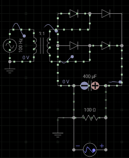

## Rectificación de onda completa

En un rectificador de onda completa con diodos en puente se invierten los semiciclos negativos, convirtiendo la señal en una sucesión de pulsos positivos:

$$
V_{\text{rect}}(t) = |V_P \cdot \sin(\omega t)|
$$

En cada semiciclo se abren dos diodos dejando a los dos restantes abiertos.

la caida de tensión entre los nodos A y B sale por ley de mallas,

$$
V_{AB} = 2 V_D + V_R
$$

**Cálculo del valor promedio de $V_R$**
El valor promedio (o componente DC) de una señal periódica se calcula integrando sobre un periodo completo y dividiendo entre la longitud del periodo. Para la señal rectificada de onda completa:

$$
V_R = \frac{1}{T} \int_{0}^{T} |V_P \cdot \sin(\omega t)| \, dt
$$

Donde $V_P$ es la tensión pico de $V_{AB}$. Debido a la simetría de la onda rectificada, podemos integrar solo medio ciclo $0$ a $\pi$ y multiplicar por 2:
  
$$
V_R = \frac{2}{T} \int_{0}^{T/2} V_P \cdot \sin(\omega t) \, dt
$$

Como \(T = \frac{2\pi}{\omega}\), sustituyendo y resolviendo la integral:

$$
V_R = \frac{2 \omega}{2\pi} \int_{0}^{\pi/\omega} V_P \cdot \sin(\omega t) \, dt
$$

$$
V_R = \frac{V_P}{\pi} \left[ -\cos(\omega t) \right]_0^{\pi/\omega}
$$

$$
V_R = \frac{2V_P}{\pi}
$$

**Ejemplo numérico:**
Si \(V_P = 10\,V\):
- Rectificador de onda completa:  
  $$
  V_{CD} = \frac{2 \cdot 10}{\pi} \approx 6.37\,V
  $$
- Rectificador de media onda:  
  $$
  V_{CD} = \frac{10}{\pi} \approx 3.18\,V
  $$

### Experimento 

Se utilizan 4 diodos para capturar tanto las contribución del semiciclo positivo como la del negativo. Agregamos tambien un capacitor para suavizar la salida.

### Cálculo del factor de ripple

El ripple (o rizado) es la variación residual de voltaje en la salida DC debido a que el rectificador no entrega una corriente perfectamente plana.

El factor de ripple ($\gamma$) mide la "pureza" de la salida DC y se calcula como:

$$
\gamma = \frac{V_{AC}}{V_{DC}}
$$

​donde $V_{DC}$ es el voltaje promedio de la señal y $V_{AC}$ es el rizado calculados así, 

$$
V_{DC} = MEAN(V_R)
$$

$$
V_{AC} = \sqrt{ MEAN((V_R - V_{DC})^2)}
$$

​
**¿Cómo interpretar el resultado?**

$\gamma< 5$ %: Ripple bajo (bueno para electrónica sensible).

$5\% < \gamma < 10$ %: Aceptable para aplicaciones generales.

$\gamma > 10$ %: Necesitas mejorar el filtrado (aumentar capacitancia).