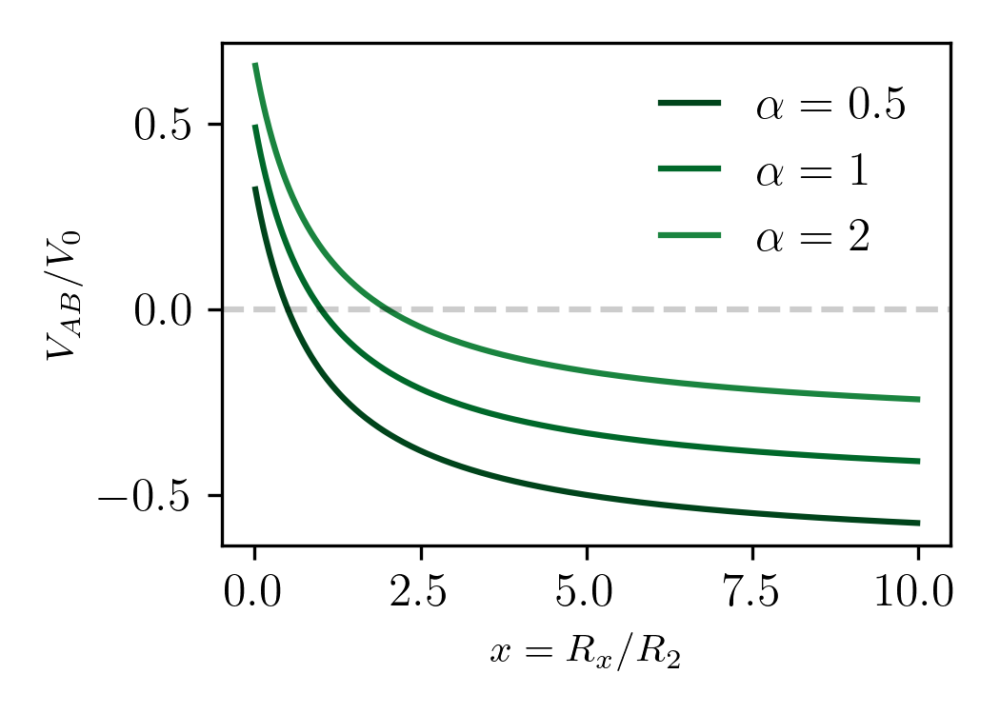

## Puente de Wheatstone

El puente divide la corriente del circuito:

$$
I= I_1+I_2
$$

Las corrientes que circulan por las dos ramas del puente se pueden escribir como:

$$
I_1 = \frac{V_0}{R_1+R_2}
$$

$$
I_2 = \frac{V_0}{R_3+R_x}
$$

Busco la diferencia de potencial entre A y B del circuito:

$$
V_A- V_B= I_1 R_2 - I_2 R_x

$$

$$
V_A-V_B = V_0 \big( \frac{R_2}{R_1+R_2} - \frac{R_x}{R_3+R_x}  \big)
$$

La condición de equilibrio del puente es $V_{AB}=0$, luego la relación entre resistencias debe cumplir:

$$
\frac{R_2}{R_1+R_2} - \frac{R_x}{R_3+R_x} = 0
$$

$$
R_2(R_3 + R_x) = R_x(R_1+R_2)
$$

$$
\frac{R_x}{R_3} = \frac{ R_2}{R_1} 
$$

Entonces la idea para medir la resistencia incognita es variar $R_2$ hasta que el puente este en equilibrio, $V_{AB}=0$, una vez fijado el valor de esta resistencia puedo hacer la cuenta anterior.

### El puente como sensor de cambios de resistencia

Supongamos que queremos sensar cambio en $R_x$, esto puede ser por ejemplo por que es un led fotoreceptor donde los cambios de iluminación producen cambios en la resistencia del led. Una buena idea para sensar esos cambios es traducirlo a cambios de la tension $V_{AB}$.

Definimos $x = \frac{R_x}{R_3}$ y $\alpha= \frac{ R_2}{R_1}$, luego:

$$
\frac{V_{AB}}{V_0} = \frac{\alpha}{1-\alpha} - \frac{x}{1-x}
$$

Escrito así, el puente esta en equilibrio cuando $x=\alpha$.

Entonces, podemos ver que la tensión en los bornes del puente varia de la sigiuente manera para distintos valores de $\alpha$:

Note que cuando $V_{AB}/V_0 =0$ el puente esta en equilibrio y $x=\alpha$.

Entonces, como en el caso del divisor de tensión, de la relación $R_x/R_3$ puedo obtener el rango de mayor sensibilidad:

$$
0<R_x<2R_3
$$

Y de la relación $R_2/R_1$ obtengo la translación de la curva en el *eje y*. 

Si $\alpha\to0$, el puente se transforma en divisor de tensión invertido, para $x\to0$ la tensión tiende a 0, y para $x\to\infty$ la tensión tiende a $-V_0$.

Si $\alpha\to\infty$, el puente se transforma en divisor de tensión, para $x\to0$ la tensión tiende a $V_0$, y para $x\to\infty$ la tensión tiende a $0$.
