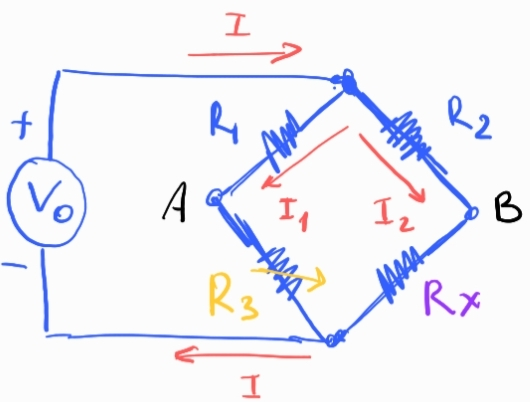

## Puente de Wheatstone

El puente divide la corriente del circuito:

$$
I= I_1+I_2
$$

Las corrientes que circulan por las dos ramas del puente se pueden escribir como:

$$
I_1 = \frac{V_0}{R_1+R_3}
$$

$$
I_2 = \frac{V_0}{R_2+R_x}
$$

Busco la diferencia de potencial entre A y B del circuito:

$$
V_A-V_B = I_1 R_3 - I_2 R_x
$$

$$
V_A-V_B = V_0 \big( \frac{R_3}{R_1+R_3} - \frac{R_x}{R_2+R_x}  \big)
$$

La condición de equilibrio del puente es $V_{AB}=0$, luego la relación entre resistencias debe cumplir:

$$
\frac{R_3}{R_1+R_3} - \frac{R_x}{R_2+R_x} = 0
$$

$$
R_3(R_2 + R_x) = R_x(R_1+R_3)
$$

$$
\frac{ R_3}{R_1} = \frac{R_x}{R_2} 
$$

El cosiente entre las resistencias de la rama 1 tiene que ser igual al cociente entre las resistencias de la rama 2.

Entonces la idea para medir la resistencia incognita es variar $R_3$ hasta que el puente este en equilibrio, $V_{AB}=0$, una vez fijado el valor de esta resistencia puedo utilizar la expresión anterior para obtener el valor de $R_x$.

### El puente como sensor de cambios de resistencia

Sea $R_e$ la resistencia que equilibra el puente, supongamos que en $R_x$ hacemos una pequeña perturbación respecto al equilibrio:

$$
R_x = R_e + \Delta R
$$

luego la caída de potencial en los bornes del puente puede expresarse así:

$$
\frac{V_{AB}}{V_0} =  \frac{R_3}{R_1+R_3} - \frac{R_e + \Delta R}{R_2+ R_e+\Delta R}
$$

$$
\frac{V_{AB}}{V_0} =  \frac{R_3}{R_1+R_3} - \frac{R_e (1+ \frac{\Delta R}{R_e})}{ (R_2 + R_e) (1+ \frac{\Delta R}{ R_e + R_2}) }
$$

Usando la condición de equilibrio $R_e = R_2R_3/R_1$, se puede ver que:

$$
\frac{R_e}{R_2 + R_e} = \frac{R_3}{R_1 + R_3} = \gamma
$$

Luego podemos escribir:

$$
\frac{V_{AB}}{V_0} = \gamma \big( 1 - \frac{ 1+ \frac{\Delta R}{R_e} }{ 1 + \frac{\Delta R}{R_e}\gamma  }     \big)
$$

El siguiente término se puede expandir en serie así:

$$
\frac{ 1 }{ 1 + \frac{\Delta R}{R_e}\gamma } \approx 1 -  \frac{\Delta R}{R_e}\gamma
$$

luego

$$
\frac{V_{AB}}{V_0} \approx \gamma \big [ 1 - ( 1 + \frac{\Delta R}{R_e} ) (1 -  \frac{\Delta R}{R_e}\gamma) \big]
$$

Haciendo la distribución y despresiando términos de orden $\Delta R ^2$, obtenemos:

$$
\frac{V_{AB}}{V_0} \approx \frac{\Delta R}{R_e} \gamma (\gamma-1)
$$

En terminos de las resistencias:

$$
\gamma (\gamma-1) = \frac{R_e}{R_2 + R_e} (\frac{R_e}{R_2 + R_e} -1 ) = \frac{R_e}{R_2 + R_e} ( \frac{-R_2}{R_e + R_2} ) = - \frac{R_3}{R_1+R_3} \frac{R_2}{R_e + R_2}
$$

luego la tensión:

$$
\frac{V_{AB}}{V_0} \approx - \frac{\Delta R}{R_e} \frac{R_3 R_2}{ (R_1+R_3)(R_e + R_2) }
$$

Note que si el puente tiene todas las resistencias iguales, $R_e=R_1=R_2=R_3$, entonces la caída de tensión es:

$$
\frac{V_{AB}}{V_0} \approx -\frac{1}{4} \frac{\Delta R}{R_e}
$$

En el siguiente gráfico vemos que esta aproximación funciona muy bien para cambios pequeños en la resistencia:

