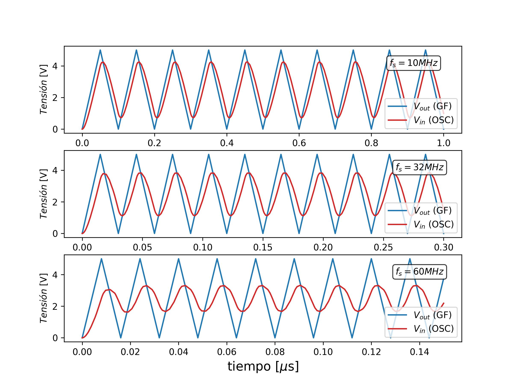

## Distorción de señal por capacitancia parásita en los cables BNC

### 1. Modelo

A altas frecuencias la señal que le llega al osciloscopio desde el generador de funciones puede verse distorsionada.

Esto se debe a que en los cables se crea una capacitancia parásita extendida que modifica la señal entregada.

La forma más simple de modelar este efecto es considerar que la conexión entre generador y osciloscopio puede pensarse así:

De un lado tengo el thevenin del generador, con un resistencia de salida $R_{out}$, del otro lado tengo el thevenin del Osciloscopio con una resistencia de entrada $R_{in}$, y en el medio, entre la conexión del vivo y la tierra del cable BNC tengo un capacitor parásito $C_p$.

Los **valores típicos** en esta configuración son:

- $R_{out} \approx 50 \Omega$, impedancia de salida del generador
- $R_{in} \approx 1 M\Omega$, impedancia de entrada al Osciloscopio.
- $C_p \approx 100 \frac{pF}{m}$, viene dado por el fabricante de cables, significa que cada 1 metro agrega $100pF$ de capacitancia. Supongamos que tienen un cable de 2 metros, en ese cado $C_p \approx 200 pF$.

La **tensión de salida en función de la tensión de entrada**  puede escribirse así:

$$
V_{in} = V_{out} \cdot \frac{Z_{eq}}{Z_{out} + Z_{eq}}
$$

donde las impedancias son:  

$$
Z_{eq} = Z_{in} \parallel \frac{1}{j \omega C_{par}} = \frac{Z_{in} \cdot \frac{1}{j \omega C_{par}}}{Z_{in} + \frac{1}{j \omega C_{par}}}
$$

$$
Z_{out}=R_{out}
$$

$$
Z_{in}=R_{in}
$$

Luego trabajando un poco la expresión, queda:

$$
V_{in} = V_{out} \cdot \frac{1}{1 + \frac{R_{out}}{R_{in}} + j \omega  R_{out} C_{par}}
$$

Si $R_{in} \gg R_{out}$, como en nuestro caso, (R del osciloscopio en 1 MΩ y R del generador 50 Ω), la ecuación se puede simplificar:

$$
V_{in} \approx \frac{V_{out}}{1 + j \omega R_{out} C_{par} }
$$

Esto es un **filtro pasa-bajo** con frecuencia de corte:  

$$
f_c = \frac{1}{2 \pi R_{out} C_{par} }
$$  

Este filtro producirá **atenuación** y **desfasaje** en la señal. 

Un ejemplo numérico, nuestros Datos:  

$R_{out} = 50 \ \Omega$, $R_{in} = 1 \ \text{MΩ}$, $C_{par} = 100 \ \text{pF}$, $f = 10 \ \text{MHz} ($\omega = 2 \pi \times 10^7$).  

**Estimación de la atenuación**:  

$$
V_{in} \approx \frac{V_{out}}{1 + j \cdot (2 \pi \times 10^7) \cdot (100 \times 10^{-12}) \cdot 50} = \frac{V_{out}}{1 + j \cdot 0.314}
$$

$$
|V_{in}| = \frac{|V_{out}|}{\sqrt{1 + 0.314^2}} = 0.95 \cdot |V_{out}|
$$

A 10 MHz, hay una atenuación del 5%.

**Estimación del desfase**:

$$
\phi = -\arctan\left(\frac{\text{Parte imaginaria}}{\text{Parte real}}\right) = -\arctan(\omega R_{out} C_{par} )
$$  

$$
\phi = -\arctan(0.314) \approx -17.4^\circ.
$$  
Esto significa que \(V_{in}\) *retrasa* a \(V_{out}\) en $17.4$ grados a $10 MHz$. 

---
### 2. Simulación

Voy a simular el circuito para ver si puedo recrear el efecto de distorsión. Uso los valores tipicos:

$R_{out} = 50 \ \Omega$, $R_{in} = 1 \ \text{MΩ}$, $C_{par} = 100 \ \text{pF}$

La frecuencia de corte para estos valores esta en $f_c \approx 32 MHz$.

Voy a simular una señal tipo rampa con valor de frecuencia $10 MHz$ (por debajo de $f_c$) y al valor de la frecuencia de corte.

En el gráfico de abajo muestro los resultados:

Vemos que la distorisión es significativa a $f=10 MHz$ y totalmente distorsiva a la frecuencia de corte.

Esto muestra la importancia de considerar el efecto de los cables en circuitos de alta frecuencia.

Para esta simulación use el programa LTSpice, el archivo utilizado **circuito_paracito.asc** esta en esta misma carpeta, lo dejo por que si quieren probar por ustedes mismos.

